### Android内存泄漏相关汇总

---

#### 一：如何测试内存泄漏场景的存在
下面描述几种Android应用内存泄漏定位方法，主要是Android中能够为我们所用的检测进程内存占用的方法。  
  
##### 1. `procrank`命令
  
`procrank`命令可以获取当前系统各进程内存占用快照，但仅限于宏观尺度，无法获取进程空间内存的具体使用情况。  
  
源码参见`\extras\procrank`，关键函数介绍如下：  
```c
...
/* 读取/proc文件夹，获取pids列表 */
error = pm_kernel_pids(ker, &pids, &num_procs);

/* 读取/proc/[pid]/pagemap，读取/proc/[pid]/maps文件页信息 */
error = pm_process_create(ker, pids[i], &proc);

/* 累加页信息 */
error = pm_process_usage_flags(proc, &procs[i]->usage, flags_mask,
                                           required_flags);

/* 读取/proc/[pid]/cmdline文件，获取cmdline信息 */
getprocname(procs[i]->pid, cmdline, (int)sizeof(cmdline))

/* 读取/proc/meminfo文件，获取系统内存信息 */
print_mem_info();
...
```
  
进入adb shell，执行`procrank`，输出如下：  
  

  
极有可能您的手机`procrank`已被阉割，那就启动Android虚拟机，从`/system/xbin`目录pull一个吧，记得也要pull`/system/lib`目录的`libpagemap.so`~  
  
几个名词介绍：  
* VSS – Virtual Set Size 虚拟耗用内存（包含共享库占用的内存）  
* RSS – Resident Set Size 实际使用物理内存（包含共享库占用的内存）  
* PSS – Proportional Set Size 实际使用的物理内存（比例分配共享库占用的内存，共享库由很多进程共享，按每一个进程占有比例乘以共享库占用内存，加上USS，就是PSS）  
* USS – Unique Set Size 进程独自占用的物理内存（不包含共享库占用的内存）  

对于`VSS`、`RSS`、`PSS`均包含共享库内存占用部分，实际工作中以`USS`为参照。  
  
最底下的一行简单解释：`total`（全部）、`free`（空闲）、`buffers`、`cached`、`shmem`（共享内存）、`slab`。  
  
那么如何测试应用在使用过程中存在内存泄漏问题呢？  
  
    写个脚本，每隔固定采样时间（比如5s），执行一次procrank，把结果输出到指定文件，  
	持续多长时间你自己控制，这个过程中疯狂的使用待测app。  
  
> 注意：procrank命令不支持输出单个进程的内存信息，结果输出到指定文件前，需要用grep做过滤。（grep被阉割，请安装busybox）。  
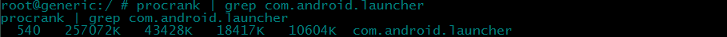
  
脚本名称：procleak.sh，当然你也可以把脚本功能完善的更丰富一点。  
```bash
#!/system/bin/sh

# Uage:
#       procleak.sh procname

if [ $# != 1 ]; then
  echo "Uage: $0 procname"
  exit 1
fi

OUTPUT='/sdcard/procleak.log'

echo 'timestamp\tPID\tVss\tRss\tPss\tUss\tcmdline' >> $OUTPUT

while true; do
  timestamp=`date '+%Y-%m-%d %H:%M:%S'`
  key=$1'$'
  meminfo=`procrank | busybox grep ${key}`

  echo $timestamp'\t'$meminfo >> $OUTPUT

  sleep 5
done

```
以手Q运行为例：  
1. `push`到手机sd卡；  
2. 执行`sh procleak.sh com.tencent.mobileqq &`,记下pid；  
> 注意：这里有坑，Windows和Linux的换行符不一样，`push`前先转一转。  
> 我习惯用Sublime Text，有一个插件不错`LineEndings`，专门用来转行尾换行符。  
3. 放肆的操作手Q，一段时候后，`kill pid`，在sd卡拿出log文件进行分析；  
  
拿到`procleak.log`，重点关注`USS`一列数据，可以借助Excel做出内存消耗曲线图。  
  
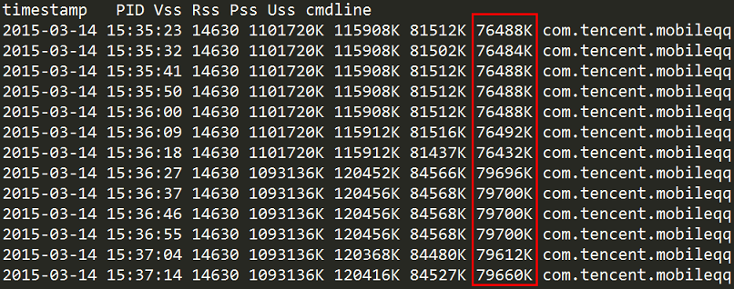
  
如果内存消耗在一段时间内保持稳定，那么可以认为没有发生leak；反之，内存消耗稳定上升，那就是有leak点了！  
  
##### 2. `showmap`命令
`showmap`命令，输出指定进程的详细的内存信息，输出如下：  
  
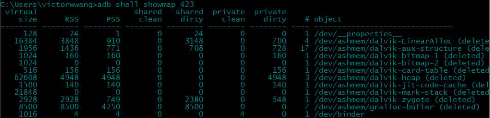
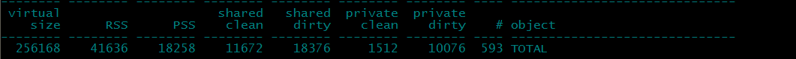
  
`VSS`、`RSS`、`PSS`上文已经解释，`object`表示mmap进来的文件名，而`shared clean`、`shared dirty`、`private clean`、`private dirty`含义是？  
  
源码参见`\extras\showmap`，关键函数介绍如下：  
```c
...
/* 读取/proc/[pid]/smaps文件，获取内存使用详细信息 */
milist = load_maps(pid, addresses, !verbose && !addresses);
...
```
  
我们可以定时执行`showmap`，记录`TOTAL`-`PSS`值，通过分析PSS的波动情况判断是否发生内存泄漏。脚本编写可以参考`procrank`命令部分。  
  
> 题外话，`procrank`没有`showmap`好使，如果待测试手机起的进程太多，`procrank`执行一次消耗的时间就比较可观了，原因是`procrank`会遍历`/proc/`目录所有进程信息，比如每隔5s执行一次`procrank`，而`procrank`执行耗时超过5s，导致日志信息采样间隔大于5s！！  
> 所以我个人还是推荐`showmap`命令。  
  
##### 3. `dumpsys`命令
`dumpsys`命令用处很多，基本可以用来dump系统的各种信息，比如内存信息、CPU信息、activities信息、windows信息、wifi信息等（adb shell dumpsys -l，输出支持列表），其源码参见`frameworks\native\cmds\dumpsys\dumpsys.cpp`。  
  
这里我们dump内存信息，命令形如`adb shell dumpsys meminfo [packagename]`，输出如下：  
  
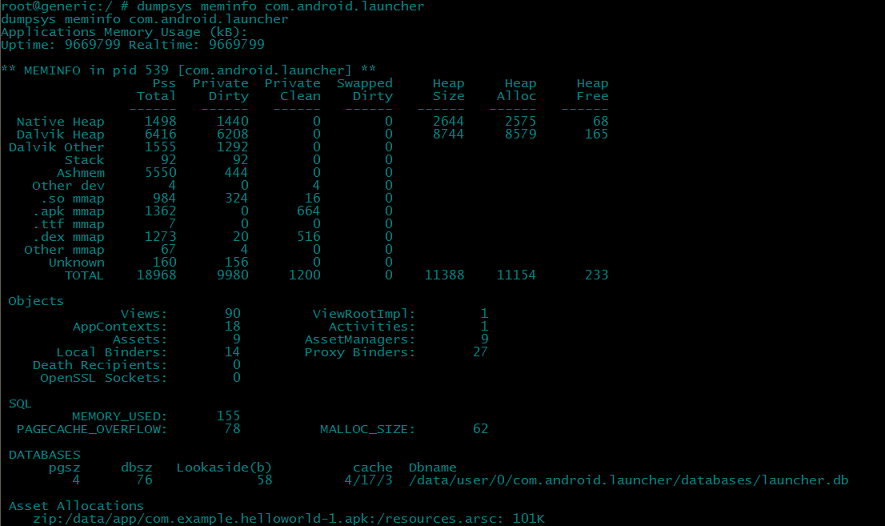
  
这里`PrivateDirty`是我们关心的数据，等同于上文`USS`。我们一样可以编写脚本，定时做`dumpsys`，提取`TOTAL`-`PrivateDirty`对应位置数据，汇总输出，最后借助Excel做出内存消耗曲线图。脚本编写可以参考`procrank`命令部分。  
  
这份表格各种指标，如不能很好理解，可以参考其实现源码`frameworks\base\core\jni\android_os_Debug.cpp`，关键函数介绍如下：  
```cpp
...
/* 调用mallinfo()，获取Heap Size */
static jlong android_os_Debug_getNativeHeapSize(JNIEnv *env, jobject clazz)

/* 调用mallinfo()，获取Heap Alloc */
static jlong android_os_Debug_getNativeHeapAllocatedSize(JNIEnv *env, jobject clazz)

/* 调用mallinfo()，获取Heap Free */
static jlong android_os_Debug_getNativeHeapFreeSize(JNIEnv *env, jobject clazz)

/* 内部调用两个关键函数：
   1. load_maps(pid, stats)，读取/proc/[pid]/smaps，分类累加进程空间每一块内存分配信息（参见showmap实现）；
   2. read_memtrack_memory(pid, &graphics_mem)，SoC厂商实现memtrack模块，读取GPU内存使用，graphics/gl/other按pss/privateDirty对待；
   3. 分类累加pss、privateDirty、privateClean、swappedOut等；
*/
static void android_os_Debug_getDirtyPagesPid(JNIEnv *env, jobject clazz,
        jint pid, jobject object)
{
	...
	load_maps(pid, stats);

	if (read_memtrack_memory(pid, &graphics_mem) == 0) {
		stats[HEAP_GRAPHICS].pss = graphics_mem.graphics;
		stats[HEAP_GRAPHICS].privateDirty = graphics_mem.graphics;
		stats[HEAP_GL].pss = graphics_mem.gl;
		stats[HEAP_GL].privateDirty = graphics_mem.gl;
		stats[HEAP_OTHER_MEMTRACK].pss = graphics_mem.other;
		stats[HEAP_OTHER_MEMTRACK].privateDirty = graphics_mem.other;
	}
	...
}
...
```
  
> 题外话，对比`dumpsys meminfo`与`showmap`实现源码，`dumpsys`的内存信息更加准确，  
> 不仅调用`load_maps(pid, stats)`读取`/proc/[pid]/smaps`文件获取内存分配信息，还调用`read_memtrack_memory(pid, &graphics_mem)`读取GPU的内存分配信息，  
> 对于那些使用GPU的应用（包含了texture、shader、vertex buffer等GPU内存占用），显然`dumpsys`是一个更好的选择。  
  
##### 4. `cat /proc/meminfo`获取系统内存信息
  
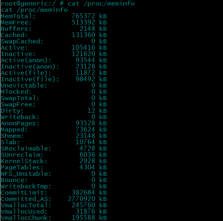
  
读取`meminfo`文件，可以获取Android系统内存分配、内存使用情况，可以了解当前系统是否处于内存紧张状态，系统层面的宏观认识，对具体到某一应用的内存情况，此方法无能为力。  
  
##### 5. `ps`获取进程信息
`ps`加`grep`，展示某一进程信息，其中进程信息包括`RSS`占用情况。可是上文我们说过，`RSS`包括共享库部分，可以参考，但是一般不用。  
  
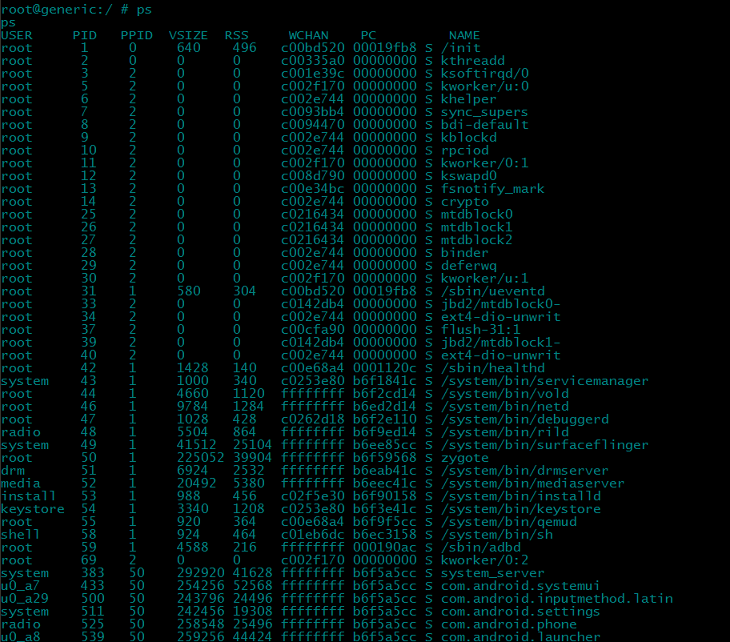
  
##### 6. Debug.getMemoryInfo()或者ActivityManager.getProcessMemoryInfo()
调用上述两个函数，都会返回`MemoryInfo`对象，`MemoryInfo`详细描述了应用内存情况，字段如下：  
  
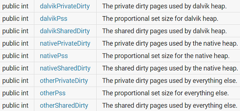
  
各字段的含义：  
`dalvik`，是指dalvik所使用的内存；  
`native`，是指native使用的内存，比如C\C\++在堆上分配的内存；  
`other`，是指除dalvik和native使用的内存，比如共享内存。  
`Private`，私有，不包含共享库；  
`Share`，包含共享库；  
`PSS`，参考上文，比例分配共享库占用的内存。  
  
其实你应该会发现，上述两个函数的返回结果，和`dumpsys meminfo`命令返回结果一致，很明显他们内部应该都是走的一套系统调用，参看源码也能佐证。  
  
* Debug源码参见`frameworks\base\core\java\android\os\Debug.java`，jni层源码参见`frameworks\base\core\jni\android_os_Debug.cpp`，相关函数如下：
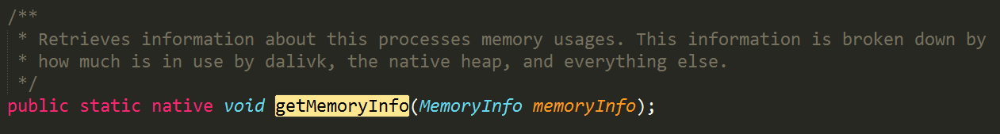
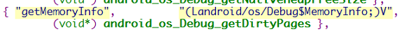
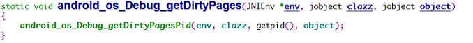
* ActivityManager源码参见`frameworks\base\core\java\android\app\ActivityManager.java`，跟进去getProcessMemoryInfo()调用工作由`ActivityManagerService`完成，源码参见`frameworks\base\core\java\android\app\ActivityManagerService.java`，相关函数如下：
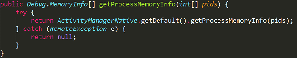
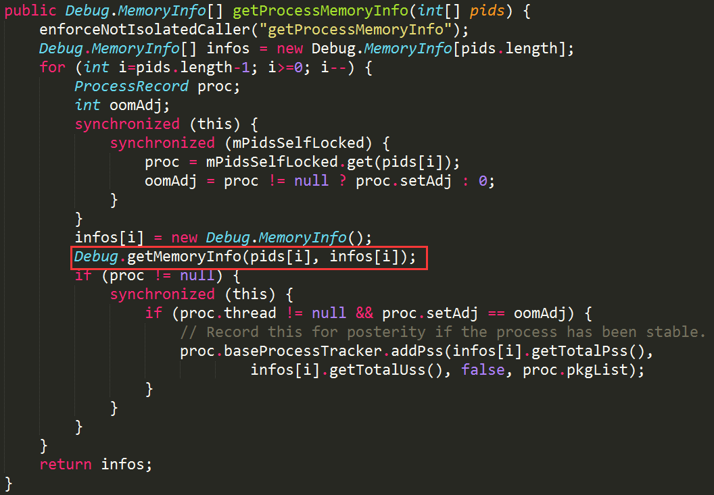
  
我们关心的是Private，调用MemoryInfo`getTotalPrivateDirty()`，可以返回进程私有内存占用，等同于上文`USS`。  
可以在App中起一个线程，每隔5s，读取MemoryInfo，输出`TotalPrivateDirty`到日志文件，测试结束后，借助Excel做出内存消耗曲线图。代码如下：  
  
```java
private Thread thread = new Thread() {

	@Override
	public void run() {
		super.run();

		String state = Environment.getExternalStorageState();
		// SDCard是否可用
		if (Environment.MEDIA_MOUNTED.equals(state)) {
			File path = new File(Environment.getExternalStorageDirectory().getPath() + "/dump/");
			if (!path.exists()) {
				path.mkdirs();
			}
			String logPath = path.getAbsolutePath();
			if (!logPath.endsWith("/")) {
				logPath += "/";
			}
			logPath = logPath + "procleak.log";
			File file = new File(logPath);

			try {
				FileWriter writer = new FileWriter(file);
				writer.write("timestamp" + "\t" + "VSS" + "\t" + "PSS" + "\t" + "USS" + "\n");
				writer.flush();
				Debug.MemoryInfo memInfo = new Debug.MemoryInfo();

				while (!finish) {
					Debug.getMemoryInfo(memInfo);
					SimpleDateFormat sdf = new SimpleDateFormat("yyyy-MM-dd-HH-mm-ss");
					String timestamp = sdf.format(new Date(System.currentTimeMillis()));

					writer.write(timestamp + "\t" + memInfo.getTotalSharedDirty() + "\t" + memInfo.getTotalPss() + "\t" + memInfo.getTotalPrivateDirty() + "\n");
					writer.flush();

					// 延时5s
					try {
						Thread.sleep(5 * 1000);
					} catch (InterruptedException e) {
						e.printStackTrace();
					}
				}

				writer.close();

			} catch (IOException e) {
				e.printStackTrace();
			}
		}
	}

};
```
  
> 题外话，借助ActivityManager.getRunningAppProcesses()与ActivityManager.getProcessMemoryInfo()，可以写一个`工具App`，  
> 专门用来获取待测试应用的内存使用，输出统计日志(完全可以借助图标库，在工具App中可视化展示)，  
> 这样在不修改待测试应用源码的（增加循环读内存信息的线程代码）基础上做到检测内存的目的。  
  
##### 7. ActivityManager.getMemoryInfo()
返回`ActivityManager.MemoryInfo`对象，获取系统当前可用内存情况，在这里没什么用。  
  
要研究源码，可以参见：  
`frameworks\base\core\java\android\app\ActivityManager.java`-getMemoryInfo()  
`frameworks\base\core\java\android\app\ActivityManagerService.java`-getMemoryInfo()  
`frameworks\base\core\java\android\os\Process.java`-getFreeMemory()/getTotalMemory()  
`frameworks\base\core\jni\android_util_Process.cpp`-getFreeMemoryImpl()，其实还是读的`/proc/meminfo`  

  
##### 8. DDMS
借助DDMS中的Heap页，可以直观的看到应用内存占用情况。  
  
具体操作：  
* 打开DDMS的Devices视图/Heap视图；  
* 选择要监控的进程；  
* 选中Devices视图上的`update heap`图标;  
* 点击Heap视图中的`Cause GC`按钮，留意`Allocated`值变动；  
* 疯狂使用待测应用，期间定时点击`Cause GC`按钮，留意`Allocated`值变动，如果数值持续上涨，那就是内存泄漏了。  
  
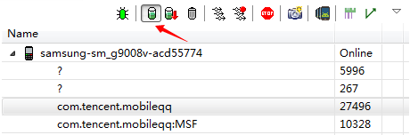
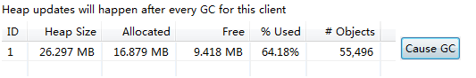
  
当然该方法比较粗糙，较小的内存泄漏可能不容易用这种方法发现。  
  
如果你习惯用Android Studio，`Memory Monitor`可以完成同样的功能，数据可视化形式也更直观、更友好。  
  
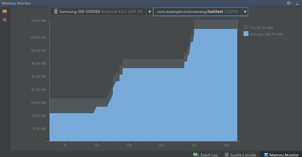
  
#### 二：如何获取hprof文件
通过上文介绍的各种方法，我们可以明确待测应用是否发生了内存泄漏，如果发生了内存泄漏，下一步就是dump出泄漏前后heap快照文件，通过分析heap快照文件，明确知道泄漏的对象是哪些，已经如何fix内存泄漏问题。  
  
##### 1. Debug.dumpHprofData()
Android API提供了Debug.dumpHprofData()获取hprof文件，通过该方法，需要修改待测试应用的源码，参考代码如下：
  
```java
public static boolean dumpHeapFile() {
	boolean ret = false;

	SimpleDateFormat sdf = new SimpleDateFormat("yyyy-MM-dd-HH-mm-ss");
	String createTime = sdf.format(new Date(System.currentTimeMillis()));

	String state = Environment.getExternalStorageState();
	// SDCard是否可用
	if (Environment.MEDIA_MOUNTED.equals(state)) {
		File file = new File(Environment.getExternalStorageDirectory().getPath() + "/dump/");
		if (!file.exists()) {
			file.mkdirs();
		}

		String hprofPath = file.getAbsolutePath();
		if (!hprofPath.endsWith("/")) {
			hprofPath += "/";
		}
		hprofPath += createTime + ".hprof";

		try {
			Debug.dumpHprofData(hprofPath);
			ret = true;
		} catch (IOException e) {
			e.printStackTrace();
		}
	} else {
		ret = false;
	}

	return ret;
}
```
  
在测试应用前，先dump出`heap快照1`，然后疯狂使用应用，让应用尽情去泄漏，一段时间后再次dump出`heap快照2`。  
  
##### 2. DDMS
直接点击Devices视图上的`Dump HPROF file`图标，导出heap快照文件，同时直接在Eclipse MAT插件中打开heap快照文件。这种方法的好处是，完全不用修改待测应用的源码，也不需要自己转换hprof文件。  
  

  
#### 三：再转hprof文件
获取的hprof文件是Dalvik格式，直接用MAT打开，会报错，需要转成Java虚拟机规范格式。  
  
	hprof-conf old.hprof new.hprof
  
#### 四：MAT打开hprof文件
启动MAT（推荐下载独立的MAT程序，Eclipse中插件装多了，会很卡的，当然Eclipse JVM参数调优可以缓解下，但只是缓解下~），Open Heap Dump，MAT分析结束默认会有两个TAB页：`Overview`、`Leak Suspects`。  
  
---
  
先解释使用MAT时会遇到的三个名词：  
  
1. `Shallow Heap`：指对象自身所占用的内存大小，不包含其引用的对象所占的内存大小。
    * 数组类型：数组元素大小乘以数组长度;
    * 非数组类型：对象大小加所有成员大小；
  
2. `Retained Heap`：当前对象大小 + 当前对象可直接或间接引用到的对象的大小总和（只存在从当前对象的引用路径）。
  
3. `GC Root`：Java中GC策略是基于对象`引用是否可达`来判断是否需要GC，引用可达判断起点就是GC Roots。JVM规范定义如下GC Roots：
    * Class：class loaded by system class loader；
    * Thread：live thread；
    * Stack Local：local variable or parameter of Java method；
    * JNI Local：local variable or parameter of JNI method；
    * JNI Global：global JNI reference；
    * Monitor Used：objects used as a monitor for synchronization；
    * Held by JVM：objects held from garbage collection by JVM for its purposes；
  
JVM在GC时，需要判断哪些内存需要回收，简单理解就是已死的对象占用的内存空间需要回收，如何确定对象已死？  
  
JVM没用采用引用计数算法，而是采用的`可达性分析（Reachability Analysis）`算法，该算法基本思路是，通过GC Roots对象作为起始点，从这些节点开始向下搜索，搜索所走过的路径称为引用链（Reference Chain），当一个对象到GC Roots没有任何引用链相连时（不可达），则证明此对象是不可用的，已死。  
  
如图所示，object5、object6、object7，就是引用不可达对象，被GC！
  

  
下面两张图，自己试着计算Retained Heap(obj1)，会对上面的三个名词理解更清晰：  
  
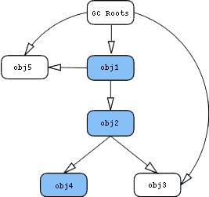
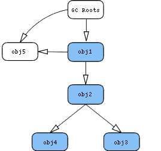
  
上图，Retained Heap(obj1) = Shallow Heap(obj1 + obj2 + obj4);  
下图，Retained Heap(obj1) = Shallow Heap(obj1 + obj2 + obj3 + obj4);  
  
其中MAT在展示对象列表时，会对`GC Root`特别标注，如图：  
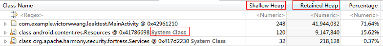
  
---
  
一则最简单的分析示例：  
1. 先从`Leak Suspects`入手，从怀疑点一开始；  
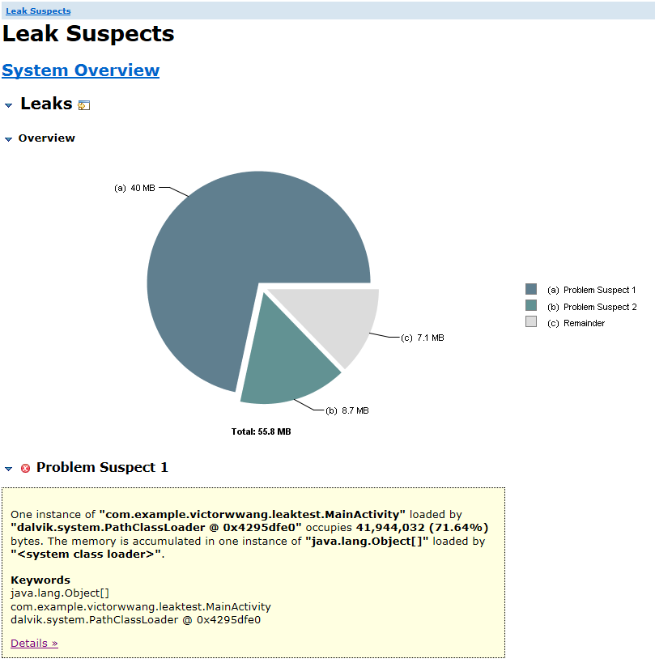
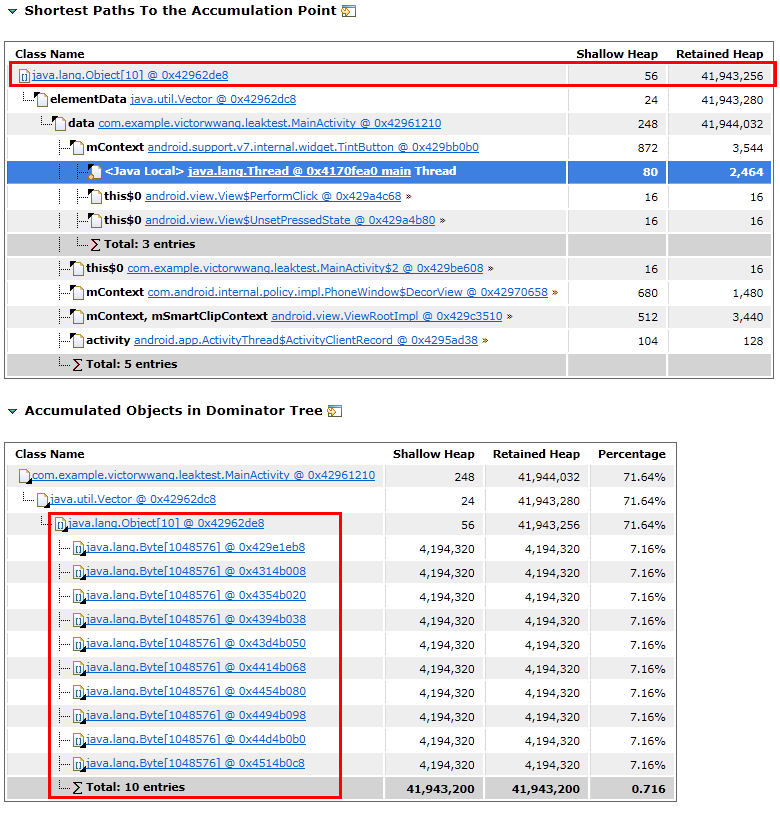
  
2. 可以发现是10个`Byte[1048576]`对象泄漏，泄漏总量41943256Byte，泄漏最短路径是：elementData-data-mContent-main Thread(GC Root)；  
3. 剩下的工作就是看代码了。  
  
上面的示例显然是最简单的，稍微复杂一点的场景，需要打开`dominator_tree`TAB页，按照`正则`搜索（正则搜索也有不适用的情形，这个时候就需要`OQL`，执行更复杂的查询逻辑），或者`Retained Heap`排序，找出可能的泄漏点。  
然后展开泄漏对象（选择`Path To GC Roots`展开，标识当前对象到GC Root引用链），通过分析引用链，就可以大致知道泄漏的问题所在了。  
  
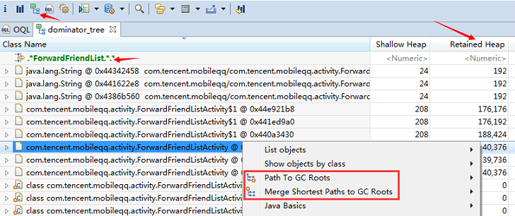
  
当然MAT有一个辅助窗口很有用，`Inspector`，对于那些匿名内部类对象，可以根据`Inspector`窗口展示的信息，推测出对应源码对应哪一个匿名内部类。内部类会有详细分析，参见后文。  
  
比如`MainActivity`中的匿名内部类`FragmentActivity$1`，分析`Inspector`展示的信息，可以得出匿名类`FragmentActivity$1`对应的源码。  
  
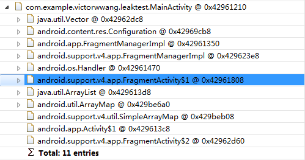
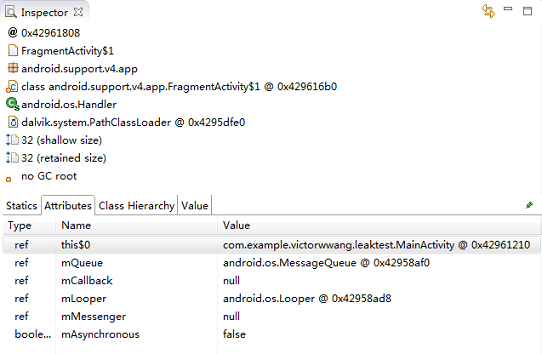
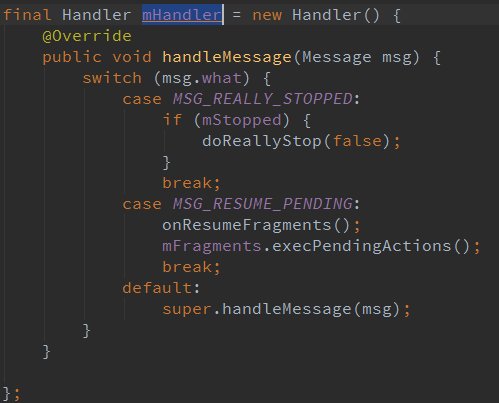
  
如果根据`Inspector`窗口信息还是定位不到匿名内部类对应哪一段代码，可以用`apktool`反编译apk，看对应匿名类的smali，这招基本没问题。  
  
比如：  
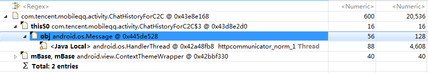
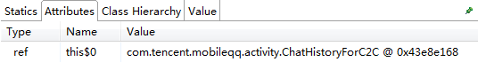


  
#### 五：Android常见内存泄漏场景汇总
其实Android中的内存泄漏，归纳一下，无非也就是几种：
  
##### 1. 引用没释放
  
1.1 有register，没有unregister  
  
`观察者`模式，不注意在合适的时机移除观察者，就很容易造成内存泄漏。  
  
**手Q案例**
手Q `QQAppInterface`中，三个观察者数组，由于QQAppInterface单例，同时生命周期和手Q Application基本一致，一旦相应组件忘记`removeObserver`，三个观察者数组就会持有相关组件引用，产生泄漏。  
  
```java
List<BusinessObserver> uiObservers = new Vector<BusinessObserver>();
List<BusinessObserver> bgObservers = new Vector<BusinessObserver>();
List<BusinessObserver> qqInitHandlerObservers = new Vector<BusinessObserver>();

public void addObserver(BusinessObserver observer, boolean beBackgroudCallback) {
	if (beBackgroudCallback) {
		if (!bgObservers.contains(observer)) {
			bgObservers.add(observer);
		}
	} else {
		if (!uiObservers.contains(observer)) {
			uiObservers.add(observer);
		}
	}
}

public void removeObserver(BusinessObserver observer) {
	uiObservers.remove(observer);
	bgObservers.remove(observer);
	qqInitHandlerObservers.remove(observer);
}
```
  
某一次，`smitt`上报某Activity泄漏问题，根据`forwardxxxxx`提示信息，编写OQL语句，查询泄漏Activity。  
  
> OQL基本语法：SELECT * FROM [INSTANCEOF] class_name [WHERE filter_expression];  
> 和SQL对比：类相当于表，对象相当于行，字段相当于列；  
  
过程如下：  
  
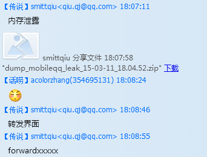
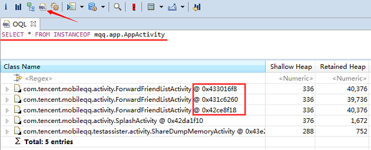
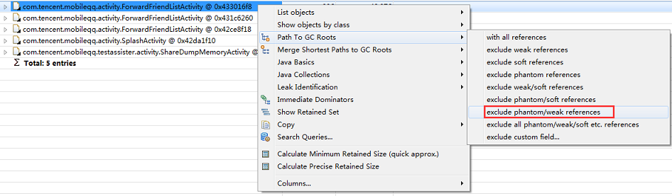
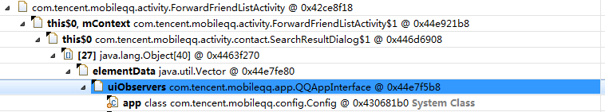
  
---
  
既然在MAT中看到了phantom/weak/soft，那就必须要好好讲讲JDK 1.2对引用这一语言特性的扩充。JDK 1.2之前，如果要实现这样的对象缓存，内存足够的时候，对象占用内存空间一直保留，内存不够的时候，对象占用内存空间自动回收，避免OOM问题，基本是不太可能的。  
  
为了解决这种类型的问题，JDK将Reference细化为4种，强度依次减弱：  
  
1. 强引用（StrongReference）
  ```java
  Object obj = new Object();
  ```
  只要强引用在，GC就永远不会回收被引用对象；  
  
2. 软引用（SoftReference）
  ```java
  Object obj = new Object();
  SoftReference<Object> softRef = new SoftReference<Object>(obj);
  ```
  JVM发现内存吃紧，快要OOM了，JVM将软引用对象标记为待回收对象，执行一次GC，释放软引用对象，进行缓解内存压力的补救工作；  
    补救了还不行，没办法了，那就报OOM了；  
  
3. 弱引用（WeakReference）
  ```java
  Object obj = new Object();
  WeakReference<Object> weakRef = new WeakReference<Object>(obj);
  ```
  JVM要执行GC了，不管内存够不够用，先释放弱引用对象再说；  
  
4. 虚引用（PhantomReference）
  虚引用主要用来跟踪对象被垃圾回收器回收的活动，用户代码基本不会用到；  
  
对于`软引用`、`弱引用`，都可以用来构造缓存系统，`软引用`适合构造数据敏感缓存，而`弱引用`适合构造数据不敏感缓存。  
  
当然，`弱引用`还有一大作用，将引用路径调整为弱引用路劲，堵住泄漏（只要JVM执行GC，路径就断开了）。  
  
---

  
1.2 Context泄漏
  
Activity泄漏最为典型，Context-Activity生命周期和Activity生命周期不一致。  
  
**官方案例**（Android早期源码的bug，现已fix）  
  
场景：下面代码的初衷，在设备屏幕方向变化时，不用每次都构造Drawable对象，提高界面展示效率。  
```java
private static Drawable sBackground;

@Override
protected void onCreate(Bundle state) {
  super.onCreate(state);
  
  TextView label = new TextView(this);
  label.setText("Leaks are bad");
  
  if (sBackground == null) {
    sBackground = getDrawable(R.drawable.large_bitmap);
  }
  label.setBackgroundDrawable(sBackground);
  
  setContentView(label);
}
```
  
原因：label.setBackgroundDrawable(sBackground)调用，导致sBackground持有label引用，进而持有Context-Activity！  
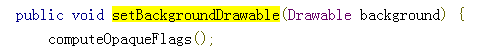

一个static对象持有Context-Activity引用，该Activity onDestory()后，显然不会回收了！！  
  
怎么改：sBackground持有label的WeakReference。  

  
回到这个示例，static的Drawable持有TextView的WeakReference，进而到Context-Activity的引用路径为弱引用路劲，进而也就能堵住Activity泄漏了！  
  
**Message的坑**  
  
场景：下面代码最常见不过，借助Handler/Looper执行某一任务，或者实现线程间通信。  
```java
public class SampleActivity extends Activity {
 
  // 内部类，持有SampleActivity引用
  private Handler mLeakyHandler = new Handler() {
    @Override
    public void handleMessage(Message msg) {
      // ...
    }
  };
 
  @Override
  protected void onCreate(Bundle savedInstanceState) {
    super.onCreate(savedInstanceState);
 
	// Runnable在内部封装成Message，Meassge持有mLeakyHandler引用
    mLeakyHandler.postDelayed(new Runnable() {
      @Override
      public void run() { /* ... */ }
    }, 1000 * 60 * 10);  // 延时10min执行
 	
	// Meassge持有mLeakyHandler引用
 	mLeakyHandler.sendMessageDelayed(msg, 1000 * 60 * 60);
 
    // 直接导致当前Activity onDestory()，但Activity会被立刻GC嘛？
    finish();
  }
}
```
  
其中`postDelayed()`、`sendMessageDelayed()`最后均会调用内部`enqueueMessage()`，将Message加入Looper的MessageQueue，此时会看到Messge持有Handler强引用。  
```java
private boolean enqueueMessage(MessageQueue queue, Message msg, long uptimeMillis) {
	msg.target = this;
	if (mAsynchronous) {
		msg.setAsynchronous(true);
	}
	return queue.enqueueMessage(msg, uptimeMillis);
}
```
  
至此，就有一条很清晰的引用链`Messge-Handler-Activity`。  
  
想象一下，当前消息队列含有大量的Message等待处理，你发的Messge需要等待很久才会获得执行机会，你现在关闭Activity，Message不执行完，你的Activity就一直泄漏；发送DelayMessage也同理。  
  
比如下面的一个泄漏示例：  
  
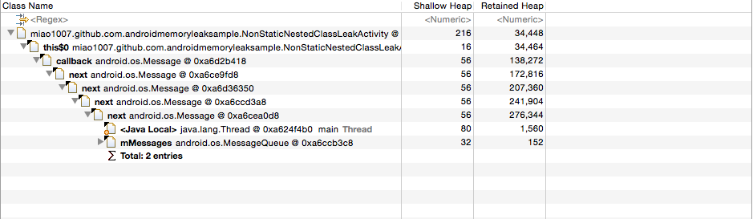
  
怎么改，两种方案：  
* Handler.removeCallbacksAndMessages(null)
选择合适的时机，调用该函数，清空MessageQueue，阻断引用链`Messge-Handler-Activity`；
  
* 使用静态内部Handler + WeakReference
静态内部handler不会持有外部Activity引用，采用WeakReference来持有外部Activity引用，堵住泄漏引用链；  
  
手Q中就是这样干的：  
  
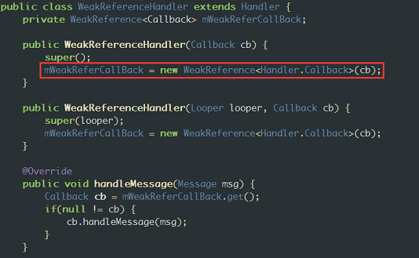
  
* github开源方案，如[github.com/badoo/android-weak-handler](https://github.com/badoo/android-weak-handler)等，解决内存泄漏的同时，还支持对MessqgeQueue任务更有效的调度。  
  
---

`内部类`，简单理解，就是一个类的定义放在另外一个类的定义内部，同时定义为非static。  
  
注意有匿名和非匿名之分。  
  
```java
public class Outer {

    private int i1 = 0;
    protected int i2 = 0;
    public int i3 = 0;
    int i4 = 0;

    // 内部类
    public class Inner {

        public int func() {
            return i1 + i2 + i3 + i4;
        }

    }

    // 匿名内部类
    public Inner mInner = new Inner() {
        public int func() {
            return super.func() + 10;
        }
    };

}
```
  
`内部类`可以访问外部类所有成员（private、protected、public、包访问控制权限），但是该特性把握不好，会是`内存泄漏`、Android`方法数超65535`的罪魁祸首！  
  
为什么如此，我们借助`javap`反编译Outer$Inner.class，Outer.class，查看相关字节码，一目了然！  
  
> javac Outer.java  
> javap -v Outer$Inner.class  
> javap -v Outer.class  
  
截取`Outer$Inner.class`部分字节码  
  
```java
...
// 编译器给内部类添加成员变量，final，指向外部类对象
final Outer this$0;
    flags: ACC_FINAL, ACC_SYNTHETIC


  // 编译器给内部类构造函数添加形参，外部类对象
  public Outer$Inner(Outer);
    flags: ACC_PUBLIC

    Code:
      stack=2, locals=2, args_size=2
         0: aload_0       
         1: aload_1       
		 // 字段设置字节码，this$0指向外部类对象
         2: putfield      #1                  // Field this$0:LOuter;
...
  public int func();
    flags: ACC_PUBLIC

    Code:
      stack=2, locals=1, args_size=1
         0: aload_0       
         1: getfield      #1                  // Field this$0:LOuter;
		 // 访问外部类private成员，通过access方法
         4: invokestatic  #3                  // Method Outer.access$000:(LOuter;)I
         7: aload_0       
         8: getfield      #1                  // Field this$0:LOuter;
		 // 访问外部类protected成员，直接走.操作符
        11: getfield      #4                  // Field Outer.i2:I
        14: iadd          
        15: aload_0       
        16: getfield      #1                  // Field this$0:LOuter;
		// 访问外部类public成员，直接走.操作符
        19: getfield      #5                  // Field Outer.i3:I
        22: iadd          
        23: aload_0       
        24: getfield      #1                  // Field this$0:LOuter;
		// 访问外部类包访问权限成员，直接走.操作符
        27: getfield      #6                  // Field Outer.i4:I
...
```
```java
...
  static int access$000(Outer);
    flags: ACC_STATIC, ACC_SYNTHETIC

    Code:
      stack=1, locals=1, args_size=1
         0: aload_0       
         1: getfield      #1                  // Field i1:I
         4: ireturn       
      LineNumberTable:
        line 1: 0
...
```
  
总结，内部类能够访问外部类所有成员，原因有二：  
* 内部类持有`外部类引用`  
如果内部类泄漏，因为存在对外部类的引用，外部类也就泄漏了;  
  
* 内部类访问外部类private成员，是因为外部类对那些内部类会访问的private成员，生成了`access()`访问方法
那些内部类不妨问的private成员，就不管了；  
这里对这些private成员多生成了一个`access()`，显然会增加Android主dex方法数；  

---
  
##### 2. 资源没close
一般这些资源对象，为了加快资源读写速度都是带缓冲区的，缓冲不仅存在于Dalvik堆，也会存在于系统层面，如果简单的把资源对象的引用置为null，系统层面缓冲就得不到回收，也就发生了内存泄漏。  
  
2.1 File close()
  
2.2 Cursor close()
  
2.3 Bitmap recycle()
  
##### 3. JNI内存泄露
  
JVM进程内存模型如下图，Dalvik可以等效看待：  
  

  
JVM GC负责对永久代、新生代、老年代的内存的回收，而JNI层通过malloc系统调用分配的堆内存，不在JVM GC负责范围之内，这一块的内存泄漏直接会导致应用所属的虚拟机进程挂掉。  
  
如何解决：C++/C代码编写规范，避免内存泄漏；或者使用`Valgrind`等工具检测。  
  
个人经历案例：...  
  
#### 未完待续，[手Q中的内存泄漏检测模块](./手Q中的内存泄漏检测模块.md)~
  
<br />
#### 六：参考链接
1. [How do I discover memory usage of my application in Android?](http://stackoverflow.com/questions/2298208/how-do-i-discover-memory-usage-of-my-application-in-android)
2. [也谈Android内存那点事——深入内存数据和MAT应用](http://km.oa.com/group/2714/articles/show/109931?kmref=search)
3. [Android内存泄露工具MAT使用介绍](http://km.oa.com/group/23213/articles/show/197041?kmref=search)
4. [Android内存 系列文章](http://hubingforever.blog.163.com/blog/#m=0&t=1&c=fks_084065082084086064081084083095085081080067080086083068093)
5. [Memory Analyzer tool(MAT)分析内存泄漏---理解Retained Heap、Shallow Heap、GC Root](http://blog.csdn.net/hhww0101/article/details/8133219)
6. [内存管理(3)-Android 内存泄露分析](http://www.jianshu.com/p/c59c199ca9fa)
7. [linux 内存查看方法：meminfo\maps\smaps\status 文件解析](http://www.cnblogs.com/jiayy/p/3458076.html)
8. [Android内存分析和调优](http://my.oschina.net/jerikc/blog/391907)
9. [Android 4.4 meminfo 实现分析](http://tech.uc.cn/?p=2714)
10. [Android源码学习之六——ActivityManager框架解析](http://blog.csdn.net/caowenbin/article/details/6036726)
11. [Avoiding memory leaks](http://android-developers.blogspot.com/2009/01/avoiding-memory-leaks.html)
12. [android-weak-handler](https://github.com/badoo/android-weak-handler)
13. [深入理解java内部类](http://km.oa.com/group/21869/articles/show/202156?kmref=related_post)
