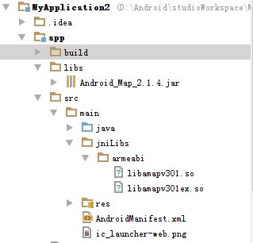
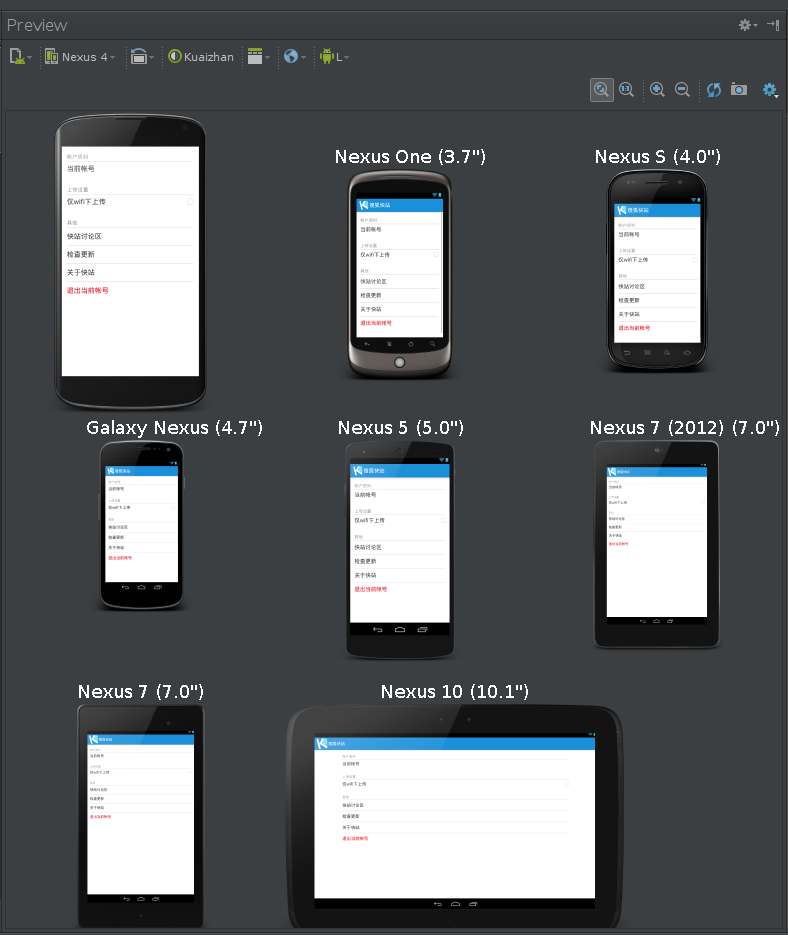

## Android开发-工程结构

#### Android工程典型结构  
使用`Eclipse`与`Android Studio`开发，Android Project的结构组织有较大出入，本文将分别描述  
  
###### 1. Eclipse，默认`Ant`构建工具[工程结构，参考1][1]
  
  
| 名称 | 描述 |
| :---: | :--- |
| AndroidManifest.xml | 描述应用基本特征，定义应用组件(四大组件`Activity`、`Service`、`BroadcastReceiver`、`ContentProvider`) |
| project.properties | 工程设置，包括编译目标、ProGuard配置等；低版本`ADT`该文件名为`default.properties` |
| local.properties | 设置本地Java SDK路径，用于`Ant`构建 |
| ant.properties | 配置Release发布的签名信息，用于`Ant`构建 |
| build.xml | `Ant`构建文件 |
| /src/ | 包括`Java`源码、`AIDL`源码(.aidl)、`RenderScript`源码(.rs)，当然少不了相应的包结构目录 |
| /bin/ | 包含各种编译输出结果(具体编辑过程，后面文章在说)，包括最终的`APK`文件 |
| /jni/ | 包含`NDK`工程源文件、编译输出 |
| /gen/ | 包含资源文件编译输出的`R`文件，aidl文件编译输出的`Java`文件，rs文件编译输出的`Java`文件 |
| /libs/ | 第三方jar包、`so`文件，对于so文件需要将指定版本放置于对应子目录(`armeabi`、`armeabi-v7`、`x86`、`mips`，安装App时筛选正确版本的so) |
| /assets/ | 可以放置任何文件，简单打包进apk文件，所以在R.java中不存在id，通过`AssetManager`访问 |
| /res/ | 包含各种子路径，各个子路径存放对应资源，各个子路径(稍后详述，子目录名称规则) |
  
 
  
###### 2. Android Studio，默认`Gradle`构建工具[Gradle Android Plugin，参考2][2]
> Android Studio新建Android工程，存在`Project`与`Module`的概念，一个Android应用对应一个`Module`(和`Visual Studio`的`WorkSpace`、`Project`一个意思)；  
> Gradle和Maven一样，强调约定优于配置，所以下面给出的均是约定的结构  
  
对于一个`Module`结构如下：  
  
| 名称 | 描述 |
| :---: | :--- |
| /src/ | 包含两种`source sets`，分别是`src/main/`、`src/androidTest/` |
| /src/main/AndroidManifest.xml | 参见上表`AndroidManifest.xml`描述 |
| /src/main/ic_launcher-web.png | 512*512应用图标，用于`Google Play`展示 |
| /src/main/java/ | 包含工程`Java`源码 |
| /src/main/aidl/ | 包含工程`AIDL`源码 |
| /src/main/rs/ | 包含工程`RenderScript`源码 |
| /src/main/jni/ | 包含`NDK`工程源码 |
| /src/main/assets/ | 包含工程资源，参见上表`/assets/`描述 |
| /src/main/res/ | 包含工程资源，参见上表`/res/`描述 |
| /libs/ | 第三方jar包 |
| /build/ | 包含唯一子目录`/build/generated/`，存放编译中间结果(R文件，rs编译输出，aidl编译输出等) |
| /build.gradle | 该`Module`构建脚本 |
  
注意:在Android Studio中引入`.so`本地库，由于一开始`gradle`的`android`插件在这一块支持的不好，导致有三种方式[方式一二][13]/[方式三][14]，我们推荐第三种方式：新建目录`/src/main/jniLibs`，并把相关`.so`本地库拷贝至该目录，不需要修改`build.gradle`。  
  

  

对于`Project`结构如下：  
  
| 名称 | 描述 |
| :---: | :--- |
| /libraries/ | 可以放置依赖的本地工程，可与`Eclipse`依赖本地Library方式对比(个人觉得Eclipse的方式要方便) |
| /XXXX/ | 上文所描述的`Module`文件夹 |
| /local.properties | 参见上表`local.properties`描述，用于`Gradle`构建 |
| /build.gradle | 该`Project`构建脚本 |
| /settings.gradle | 配置需要构建的模块列表，与`/build.gradle`协作完成多模块构建(和`Maven`多模块构建方式基本一致) |
  
 
  
###### 3. 到底是选择Eclipse开发还是选择Android Studio开发？
* Android Studio是Google基于`IntelliJ IDEA`专门针对Android推出，智能程度甩Eclipse几条街
* 依赖管理承接Maven，如果你用Eclipse，一个一个下载jar包，jar包版本冲突解决，都太麻烦了
* Gradle构建脚本灵活容易，多平台发布
* Android Studio多分辨率渲染
  

  
* 所以开发Android强烈推荐Android Studio(Beta版已出)
  
###### 4. /res/目录详解[Resource Types，参考3][3]
> 如下目录都不能再新建子目录，否则编译失败(参见`aapt`)
  
| 名称 | 描述 |
| :---: | :--- |
| res/anim/ | 放置补间动画、插值器、布局动画媒介等XML文件，动画部分后文再说[参考4][4] |
| res/animator/ | 放置属性动画XML文件，动画部分后文再说[参考4][4] |
| res/color/ | 放置颜色状态XML文件[参考5][5] |
| res/drawable/ | 放置PNG、JPEG、GIF文件，9-Patch、Shape、[逐帧动画][10]等XML文件[**重点！**参考6][6]|
| res/layout/ | 放置布局XML文件[参考7][7] |
| res/menu/ | 放置菜单定义XML文件[参考8][8] |
| res/raw/ | 可放置任意文件，但是会被`aapt`编译，所以可以使用R.raw.XXXX方式引用资源，推荐只放置一些多媒体数据 |
| res/xml/ | 放置用于应用配置的XML文件 |
| res/values/ | 放置涉及颜色值、尺寸值、属性定义值、字符串、样式等XML文件 |
  
既然上表说到`res/drawable/`是重点，那么现在具体说一说。  
* 一是`drawable`的种类很多，显示的图片文件(.png、.jpg、.gif、.9.png)，还有一堆用XML描述的文件
  
> 用小Bitmap文件构建的XML Bitmap，在XML中指定小Bitmap文件的平铺方式，完成有规律图片的制作；  
  
> 用.9文件构建的XML .9，用于控制.9图片拉伸抖动；  
  
> 用一组drawable组合成的层叠drawable(Layer List)，典型应用自定义ProgressBar(进度显示，其实就是通过曾叠drawable)；  
  
> 用一组drawable组合成的状态drawable(State List)，典型应用自定义Button的点击状态和非点击状态；  
  
> 用一组drawable组合成的等级drawable(Level List)，对于ImageView组件，在不同场景需要显示不同图片，可以使用这种drawable(不过i哦我用的不多)；  
  
> 用两个drawable组合成的过度drawable(Transition Drawable)，用于设置淡出淡入过渡动画；  
  
> 用XML描述的Shape，可以指定Shape的形状、圆角、颜色、边框样式颜色、渐变，**对于能够用Shape写出来的drawable就坚决不用切图！**  
  
> 用现有drawable制作拉伸drawable(Scale Drawable)；  
  
> 用现有drawable制作水平、竖直方向裁剪drawable(Clip Drawable)，对于ImageView组件，当需要显示图片的部分区域时比较有用；  
  
> Inset Drawable，自己去搜索吧...  
  
* 二是`res/drawable/`文件夹可能包含各种稀奇古怪的后缀，比如`res/drawable-hdpi/`，这就要说到Android适配的一个点了
  
> 即对于`res/drawable-mdpi/`与`res/drawable-hdpi/`中同名的一张.png资源，**Android有一套查找最适合资源的策略**[参考9][9]；  
  

  
> 大致意思就是说，Android系统先根据系统配置直接剔除一些冲突的`后缀文件夹`；  
  
> 然后根据[限定匹配表][11]，从上往下匹配，找到一项匹配项时，立刻剔除一些冲突的`后缀文件夹`；再重复这个过程；  
  
> 最后找到适合的`后缀文件夹`，取出指定的.png资源；  
  
> 但是需要注意的是，在根据限定匹配表匹配的时候，如果匹配了`屏幕密度`，则直接跳出，不再进行后续匹配工作；  
  
* 三是`drawable`文件夹的后缀怎么取？感觉可以按`限定匹配表`任意组合，可实际情况是，实际情况是**只按`屏幕密度`来取**
  
> 对于XML文件，直接放置于`res/drawable/`；  
  
> 对于图片文件(.png、.jpg、.gif、.9.png)，放置于`res/drawable-ldpi/`、`res/drawable-mdpi/`、`res/drawable-hdpi/`、`res/drawable-xhdpi/`、`res/drawable-xxhdpi/`、`res/drawable-xxxhdpi/`，[参考12][12];  

---
#### 参考文献
1. [Managing Projects][1]
2. [Android Tools Project Site][2]
3. [Resource Types][3]
4. [Animation Resources][4]
5. [Color State List Resource][5]
6. [Drawable Resources][6]
7. [Layout Resource][7]
8. [Menu Resource][8]
9. [How Android Finds the Best-matching Resource][9]
10. [AnimationDrawable][10]
11. [providing-resources.html#table2][11]
12. [create-bitmaps][12]
13. [在Android Studio 中加入jar 和.so 文件][13]
14. [有关Android studio工具添加高德地图API的so库文件使用说明][14]

[1]: http://developer.android.com/intl/zh-cn/tools/projects/index.html
[2]: http://tools.android.com/tech-docs/new-build-system/user-guide
[3]: http://developer.android.com/intl/zh-cn/guide/topics/resources/available-resources.html
[4]: http://developer.android.com/intl/zh-cn/guide/topics/resources/animation-resource.html
[5]: http://developer.android.com/intl/zh-cn/guide/topics/resources/color-list-resource.html
[6]: http://developer.android.com/intl/zh-cn/guide/topics/resources/drawable-resource.html
[7]: http://developer.android.com/intl/zh-cn/guide/topics/resources/layout-resource.html
[8]: http://developer.android.com/intl/zh-cn/guide/topics/resources/menu-resource.html
[9]: http://developer.android.com/intl/zh-cn/guide/topics/resources/providing-resources.html#BestMatch
[10]: http://developer.android.com/intl/zh-cn/reference/android/graphics/drawable/AnimationDrawable.html
[11]: http://developer.android.com/intl/zh-cn/guide/topics/resources/providing-resources.html#table2
[12]: http://developer.android.com/intl/zh-cn/training/basics/supporting-devices/screens.html#create-bitmaps
[13]: http://my.oschina.net/zhibuji/blog/147441
[14]: http://bbs.amap.com/thread-16638-1-1.html
