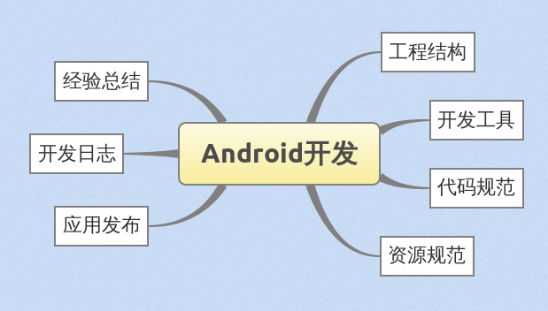

## Android开发规范系列

编写这个系列，一方面，`浩哥`让我总结些许Android开发规范，目的逐步规范组内Android产品开发；另一方面，于己更是一番复习总结，两全其美。  
  
初步决定，这个系列将包含如下部分：  
  

  
系列内容主要参考自网络，我会尽可能详尽保留参考文献。  

第一篇：[《Android开发-工程结构》](./Android开发-工程结构.md "工程结构")  
  

---
#### TODO LIST
- [x] Android开发-工程结构
- [ ] Android开发-开发工具
- [ ] Android开发-代码规范
- [ ] Android开发-资源规范
- [ ] Android开发-开发日志
- [ ] Android开发-应用发布
- [ ] Android开发-经验总结
  