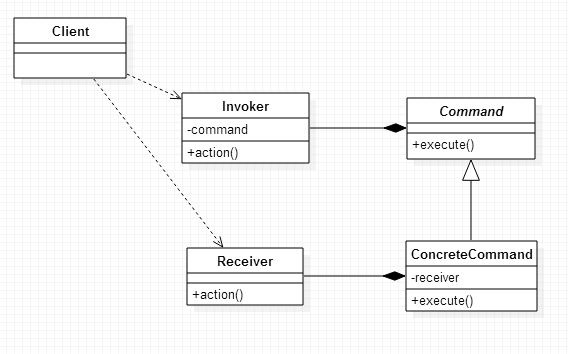

#### COMMAND模式
  
命令模式是对命令的封装，命令模式把发出命令的责任和执行命令的责任分隔开，委派给不同的对象。
  
命令模式又称为行动模式（action）或交易模式（transaction）。
  
###### 1. 结构

  
###### 2. 描述
命令模式涉及5个角色，分别为：
  
* Client：创建具体命令，确定该命令接收者，创建请求者发送命令；
* Command：具体命令抽象接口；
* ConcreteCommand：具体命令，其中包含命令接收者成员，实现命令发送者、命令接收者弱耦合；
* Receiver：命令接收者，是否需要与`ConcreteCommand`一一对应？
* invoker：命令请求者，调用命令对象，执行请求；
  
###### 3. 实现
Spring、Struts框架中，有采用命令模式。
  
* Command.java
  
```java
public interface Command {

    // 执行方法
    void execute();

}
```
  
* ConcreteCommand.java
  
```java
public class ConcreteCommand implements Command {

    private Receiver mReceiver;

    public ConcreteCommand(Receiver mReceiver) {
        this.mReceiver = mReceiver;
    }

    @Override
    public void execute() {
        mReceiver.action();
    }

}
```
  
* Receiver.java
  
```java
public class Receiver {

    // 行动方法
    public void action() {
        System.out.println("Receiver action~");
    }

}
```
  
* Invoker.java
  
```java
public class Invoker {

    private Command mConmand;

    public Invoker(Command mConmand) {
        this.mConmand = mConmand;
    }

    // 行动方法
    public void action() {
        mConmand.execute();
    }

}
```
  
* 测试
  
```java
public class Main {

    public static void main(String[] args) {
        Receiver receiver = new Receiver();
        Command command = new ConcreteCommand(receiver);

        Invoker invoker = new Invoker(command);
        invoker.action();
    }
    
}
```
  
###### 4. 扩展——宏命令
宏命令是包含命令的命令，即命令的组合。

###### 5. 参考文档
[《JAVA与模式》之命令模式](http://www.cnblogs.com/java-my-life/archive/2012/06/01/2526972.html)
[命令模式在MVC框架中的应用](http://blog.csdn.net/wsh622827/article/details/4759368)
