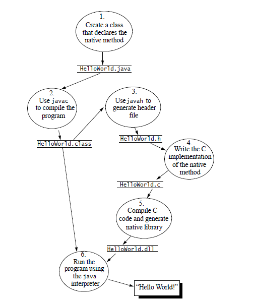
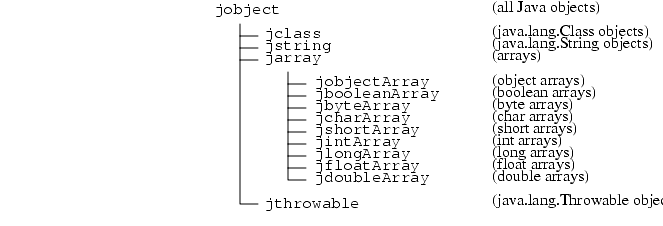

### JNI学习笔记

#### JNI是什么

* JNI（Java Native Interface）是JVM规范中的一部份，目的java、native互相调用
* JNA（Java Native Access）基于JNI封装，java调用native框架，native不能调用java  

#### JNI开发流程



> 注意：  
> 不同平台动态库后缀：windows：\*.dll，linux/unix：\*.so，mac os x：\*.jnilib  

#### JVM查找native方法

* JNI规范命名规则，java按照指定命名查找本地函数，查找效率低，不灵活  
javah生成.h文件名：包名（.用\_替换）\_类名.h  
函数名：JNIEXPORT 返回类型 JNICALL java_包名（.用\_替换）\_类名\_函数名（JNIEnv *, jclass或者jobject, ...）  
JNIEXPORT宏：函数用于外部调用，定义jni_md.h  
JNICALL宏：函数参数入栈顺序、栈清理规则，定义jni_md.h  

* JNI函数RegisterNatives()，本地函数注册，java按照注册信息查找本地函数，灵活  
JNI_OnLoad()，System.loadLibrary()时调用，进行资源初始化，调用RegisterNatives()注册  
JNI_OnUnload()，JVM释放so时调用，进行资源回收  

RegisterNatives()的一则demo：  

```

/*
 * used in RegisterNatives to describe native method name, signature,
 * and function pointer.
 */
typedef struct {
    char *name;
    char *signature;
    void *fnPtr;
} JNINativeMethod;

static JNINativeMethod s_methods[] = {
	{"callCustomClass", "(LMyJavaClass;)V", (void*)callCustomClass},
};

int JNI_OnLoad(JavaVM* vm, void* reserved)
{
	JNIEnv* env = NULL;
	if (vm->GetEnv((void**) &env, JNI_VERSION_1_4) != JNI_OK)
	{
		return JNI_ERR;
	}
	jclass cls = env->FindClass("LRegisterNativesTest;"); // 需要获取java类
	if (cls == NULL)
	{
		return JNI_ERR;
	}
	int len = sizeof(s_methods) / sizeof(s_methods[0]);
	if (env->RegisterNatives(cls, s_methods, len) < 0)
	{
		return JNI_ERR;
	}
	return JNI_VERSION_1_4;
}


```

#### JNI类型系统

* 基本类型 java/JNI映射表  

| Java Type | Native Type | Description |
|:---:|:---:|:---:|
| boolean | jboolean |unsigned 8 bits |
| byte | jbyte | signed 8 bits |
| char | jchar | unsigned 16 bits |
| short | jshort | signed 16 bits |
| int | jint | signed 32 bits |
| long | jlong | signed 64 bits |
| float | jfloat | 32 bits |
| double | jdouble | 64 bits |
| void | void | N/A |

\#define JNI_FALSE  0   
\#define JNI_TRUE   1 

typedef jint jsize;    

> 注意：  
> JNI jchar 2字节，不同于C/C++ char 1字节；  
> JNI jlong 8字节，不同于C/C++ long 4字节；  

* 引用类型 java/JNI映射表  



其中：  
C jclass类型  
typedef jobject jclass;    

C++ jclass类型  
class _jobject {};   
class _jclass : public _jobject {};   
...   
typedef _jobject *jobject;   
typedef _jclass *jclass;   

* Field Method IDs

Field Method IDs是常规的指针类型，不同于jclass  

```
struct _jfieldID;              /* opaque structure */   
typedef struct _jfieldID *jfieldID;   /* field IDs */   
 
struct _jmethodID;              /* opaque structure */   
typedef struct _jmethodID *jmethodID; /* method IDs */   
```

* JNI枚举类型jvalue

实现变长参数列表函数，jvalue就特别有用  

```
typedef union jvalue { 
    jboolean z; 
    jbyte    b; 
    jchar    c; 
    jshort   s; 
    jint     i; 
    jlong    j; 
    jfloat   f; 
    jdouble  d; 
    jobject  l; 
} jvalue; 
```

* JNI类型签名

JNI类型签名和JVM类型签名保持一致  

| Type Signature | Java Type |
|:---:|:---:|
| Z | boolean |
| B | byte |
| C | char |
| S | short |
| I | int |
| J | long |
| F | float |
| D | double |
| L fully-qualified-class ; | fully-qualified-class |
| [ type | type[] |
| ( arg-types ) ret-type | method type |

#### JNI字符串处理

JNI字符串类型jstring，包含一堆字符串处理函数，原因是JNI把Java中的所有对象当作一个C指针传递到本地方法中，这个指针指向JVM中的内部数据结构，而内部的数据结构在内存中的存储方式是不可见的，只能从JNIEnv指针指向的函数表中选择合适的JNI函数来操作JVM中的数据结构。  

* 访问字符串  

```
const jchar * GetStringChars(JNIEnv *env, jstring string, jboolean *isCopy);
```
返回unicode字符串，底层字符存储不连续，会创建缓冲区，连续存放字符，返回的就是缓冲区指针，isCopy等于JNI_TRUE表示有缓存区创建  


```
const char * GetStringUTFChars(JNIEnv *env, jstring string, jboolean *isCopy);
```
返回utf-8字符串，isCopy含义见上  


```
const jchar * GetStringCritical(JNIEnv *env, jstring string, jboolean *isCopy);
```
参考GetStringChars，目的提高JVM返回源字符串直接指针的可能性，效率会高一点  


* 释放字符串

因为底层可能创建了缓冲区，所以使用完后需要做释放  

```
void ReleaseStringChars(JNIEnv *env, jstring string, const jchar *chars);
```
```
void ReleaseStringUTFChars(JNIEnv *env, jstring string, const char *utf);
```
```
void ReleaseStringCritical(JNIEnv *env, jstring string, const jchar *carray);
```

* 字符串长度

```
jsize GetStringLength(JNIEnv *env, jstring string);
```
返回unicode字符串长度  

```
jsize GetStringUTFLength(JNIEnv *env, jstring string);
```
返回utf-8字符串长度  

* 创建字符串

```
jstring NewString(JNIEnv *env, const jchar *unicodeChars, jsize len);
```
用unicode字符串创建java String  

```
jstring NewStringUTF(JNIEnv *env, const char *bytes);
```
用utf-8字符串创建java String  

* 获取字符串指定范围字符

因为不涉及底层创建缓冲区，所以不需要release函数  

```
void GetStringRegion(JNIEnv *env, jstring str, jsize start, jsize len, jchar *buf);
```
获取指定区域unicode字符  

```
void GetStringUTFRegion(JNIEnv *env, jstring str, jsize start, jsize len, char *buf);
```
获取指定区域utf-8字符  

