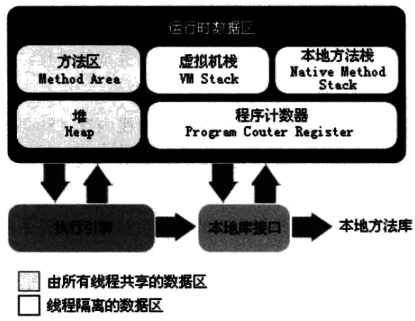
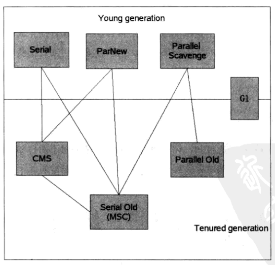
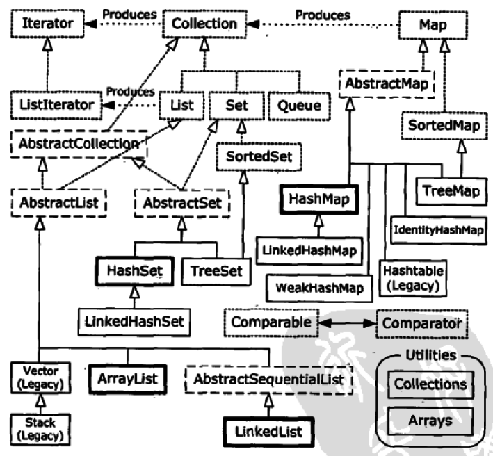

## Java一二

目录
* [Java内存泄露](./Java自己总结一二.md#JavaMemoryLeak)
* [Java垃圾收集](./Java自己总结一二.md#JavaGrabageCollection)
  * [运行时数据区域划分](./Java自己总结一二.md#GC.01)
  * [垃圾收集理论部分](./Java自己总结一二.md#GC.02)
  * [典型垃圾收集器](./Java自己总结一二.md#GC.03)
* [Java Object](./Java自己总结一二.md#JavaObject)
  * [toString](./Java自己总结一二.md#JO.01)
  * [hashCode](./Java自己总结一二.md#JO.02)
  * [equals](./Java自己总结一二.md#JO.03)
  * [clone](./Java自己总结一二.md#JO.04)
  * [wait](./Java自己总结一二.md#JO.05)
  * [notify](./Java自己总结一二.md#JO.06)
  * [getClass](./Java自己总结一二.md#JO.07)
  * [fianlize](./Java自己总结一二.md#JO.08)
* [Java Container容器](./Java自己总结一二.md#JavaContainer)
  * [ArrayList](./Java自己总结一二.md#JC.01)
  * [LinkedList](./Java自己总结一二.md#JC.02)
  * [Vector](./Java自己总结一二.md#JC.03)
  * [Stack](./Java自己总结一二.md#JC.04)
  * [HashSet](./Java自己总结一二.md#JC.05)
  * [TreeSet](./Java自己总结一二.md#JC.06)
  * [LinkedHashSet](./Java自己总结一二.md#JC.07)
  * [HashMap](./Java自己总结一二.md#JC.08)
  * [HashTable](./Java自己总结一二.md#JC.09)
  * [TreeMap](./Java自己总结一二.md#JC.10)
  * [LinkedHashMap](./Java自己总结一二.md#JC.11)
  * [小节](./Java自己总结一二.md#JC.12)
  * [ConcurrentHashMap](./Java自己总结一二.md#JC.13)
  * [CopyOnWriteArrayList](./Java自己总结一二.md#JC.14)
  * [CopyOnWriteArraySet](./Java自己总结一二.md#JC.15)
  * [ArrayBlockingQueue](./Java自己总结一二.md#JC.16)
  * [LinkedBlockingQueue](./Java自己总结一二.md#JC.17)
* [JavaConcurrent](./Java自己总结一二.md#JavaConcurrent)
  * [AtomicInteger](./Java自己总结一二.md#JCon.01)
  * [ThreadPoolExecutor](./Java自己总结一二.md#JCon.02)
* [Java泛型](./Java自己总结一二.md#JavaGenerics)


#### <a name="JavaMemoryLeak">Java内存泄露</a>
对于Java这一类`内存托管`语言，内存泄露的主要原因：保留下来却永远不再使用的对象引用。  
> 内存泄露示例  

```java
Vector v = new Vector(10);
for (int i = 0; i < 10; ++i) {
	Object o = new Object();
	v.add(o);
	o = null;
}
```

对于C/C++来说，内存泄露的范围更大一些，有些对象被分配了内存空间，然后却不可达，这些内存将永远收不回来；而在Java中，这些对象可由GC回收。  

#### <a name="JavaGrabageCollection">Java[垃圾收集][1]</a>
###### <a name="GC.01">1.运行时数据区域划分</a>
JVM执行Java程序会把它所管理的内存划分为若干个不同的数据区域。  
> JVM运行时数据区
  
<center></center>  
  
垃圾收集`堆`、`方法区`，其他区域不管。  
  
###### <a name="GC.02">2.垃圾收集理论部分</a>
垃圾收集需要完成的三件事情：那些内存需要回收？什么时候回收？如何回收？  
  
定位待回收对象，采用`根搜索算法（GC Roots Tracing）`，而不是单纯的`引用计数算法`。  
  
如何回收对象，可采用算法有：`标记清除（Mark-Sweep）`、`复制（Copying）`、`标记整理（Mark-Compact）`、`分代收集（Generational Collection）`。  
> Sun HotSpot，分代策略：方法区->`永久代`、堆一部分->`老年代`、堆一部分->`新生代`（具体细分为`Eden`、`Survivor 1`、`Survivor 2`）  
  
什么时候回收对象，一方面是说内存分配满足特定的垃圾收集器设定的阈值，触发收集；另一方面是程序线程执行到相关`安全点`/`安全区域`，垃圾收集器执行相关收集工作。  

###### <a name="GC.03">3.典型垃圾收集器</a>
> HotSpot JVM垃圾收集器
  
<center></center>  
  
重点关注的几个：`Parallel Scavenge-用于控制JVM吞吐量Throughput`、`CMS`、`G1`。其中`G1`没有分代的概念，有一个分区`region`的概念。  
  
JVM调优会涉及到垃圾收集器选择与设置。  
  
#### <a name="JavaObject">Java Object</a>
###### <a name="JO.01">1.toString()</a>
用于显示调用输出对象信息，或者`this + "string"`字符串重载`+`运算符形式，将`this`转为`String`类型（隐式调用）。  
  
###### <a name="JO.02">2.hashCode()</a>
用于`HashMap`中元素增删改查时`Key`的`Hash`操作。
> JDK`HashMap`的`hash()`源码如下
  
```java
/**
 * Retrieve object hash code and applies a supplemental hash function to the
 * result hash, which defends against poor quality hash functions.  This is
 * critical because HashMap uses power-of-two length hash tables, that
 * otherwise encounter collisions for hashCodes that do not differ
 * in lower bits. Note: Null keys always map to hash 0, thus index 0.
 */
final int hash(Object k) {
    int h = 0;
    if (useAltHashing) {
        if (k instanceof String) {
            return sun.misc.Hashing.stringHash32((String) k);
        }
        h = hashSeed;
    }

    h ^= k.hashCode();

    // This function ensures that hashCodes that differ only by
    // constant multiples at each bit position have a bounded
    // number of collisions (approximately 8 at default load factor).
    h ^= (h >>> 20) ^ (h >>> 12);
    return h ^ (h >>> 7) ^ (h >>> 4);
}
```
  
重写`hashCode()`函数是一个考点，需要注意一些细节。  
> 重写`hashCode()`函数
  
```java
public int hashCode() {
	return id != null ? id.hashCode() : 0;
    // 或者自定义Hash算法
}
```
  
###### <a name="JO.03">3.equals()</a>
用于对象相等测试，比如容器`indexOf()`、`remove()`、`contains()`等函数中。  
> JDK`ArrayList`的`indexOf()`源码如下
  
```java
/**
 * Returns the index of the first occurrence of the specified element
 * in this list, or -1 if this list does not contain the element.
 * More formally, returns the lowest index <tt>i</tt> such that
 * <tt>(o==null&nbsp;?&nbsp;get(i)==null&nbsp;:&nbsp;o.equals(get(i)))</tt>,
 * or -1 if there is no such index.
 */
public int indexOf(Object o) {
    if (o == null) {
        for (int i = 0; i < size; i++)
            if (elementData[i]==null)
                return i;
    } else {
        for (int i = 0; i < size; i++)
            if (o.equals(elementData[i]))
                return i;
    }
    return -1;
}
```
  
重写`equals()`函数是一个考点，需要注意一些细节。  
> 重写`equals()`函数
  
```java
public boolean equals(Object o) {
	// 判断自己比较自己
    if (this == o) {
    	return true;
    }
    // 判断参数，判断参数Class对象与自己Class对象
    if (o == null || getClass() != o.getClass()) {
    	return false;
    }
    A a = (A) o;
    // 判断待比较字段
    if (id != null) {
    	return id.equals(a.id);
    } else {
    	return a.id == null;
    }
}
```
  
###### <a name="JO.04">4.clone()</a>
注意浅复制与深复制。  
  
Object中默认的实现是一个浅复制，如果要实现深复制，必须对类中可变域生成新的实例。  
  
重写`clone()`，同时还应该实现标志接口`Cloneable`，当对象存在组合关系时，需要考虑组合对象的`Clone`。  
> 示例（其实`Clone()`用的不多）
  
```java
class ClassA implements Cloneable {
    @Override
    public Object clone() throws CloneNotSupportedException {
        return super.clone();
    }
}
...
class ClassB implements Cloneable {
    ClassA a;

    @Override
    public Object clone() throws CloneNotSupportedException {
        ClassB b = (ClassB) super.clone();
        if (a != null) {
            b.a = (ClassA) a.clone();
        }
        return b;
    }
}
```
  
###### <a name="JO.05">5.多个wait()</a>
用于多线程同步，阻塞线程，注意：`wait()`函数的调用必须先获取`锁`。  
  
###### <a name="JO.06">6.notify()/notifyAll()</a>
用于多线程同步，唤醒线程，注意：`notify()`/`notifyAll()`函数的调用必须先获取`锁`（与`wait()`调用时同一个`锁`）。  
> 典型用法
  
```java
// 线程一
synchronized(shareMonitor) {
	while (conditionIsNotMet) {
    	shareMonitor.wait();
    }
}
...
// 线程二
synchronized(shareMonitor) {
    shareMonitor.notifyAll();
}
```
  
> 当然可以使用显示的`Lock`、`Condition`对象
  
```java
Lock lock = new ReentrantLock();
Condition cond = lock.newCondition();
...
// 线程一
lock.lock();
try {
	while (conditionIsNotMet) {
    	cond.await();
    }
} finally {
	lock.unlock();
}
...
// 线程二
lock.lock();
try {
	cond.signal();
} finally {
	lock.unlock();
}
```
  
###### <a name="JO.07">7.getClass()</a>
获取`Class`对象，它包含了与类有关的信息，用于`RTTI`。事实上，Class对象就是用来创建类的所有`常规`对象的。  
  
每一个类都有一个Class对象。  
  
###### <a name="JO.08">8.fianlize()</a>
一旦垃圾回收器准备好释放对象占用的存储空间，将首先调用其`finalize`方法，并且在下一次垃圾回收动作发生时，才会真正回收对象占用的内存。  
  
潜在的编程陷进：将`finalize()`等同于C++析构函数。对象被回收的时机是不确定的，也可能永远不会被回收，如果资源的释放依赖于`finalize()`，那么释放可能永远也不会发生。  

#### <a name="JavaContainer">Java Container容器</a>
  
<center></center>
  
###### <a name="JC.01">1.ArrayList</a>
底层数据结构：`Object[]`。  
  
默认数组容量：10。  
> 参考源码
  
```java
...
private transient Object[] elementData;
...
public ArrayList(int initialCapacity) {
    super();
    if (initialCapacity < 0)
        throw new IllegalArgumentException("Illegal Capacity: "+ initialCapacity);
    this.elementData = new Object[initialCapacity];
}
...
public ArrayList() {
    this(10);
}
...
public ArrayList(Collection<? extends E> c) {
    elementData = c.toArray();
    size = elementData.length;
    // c.toArray might (incorrectly) not return Object[] (see 6260652)
    if (elementData.getClass() != Object[].class)
        elementData = Arrays.copyOf(elementData, size, Object[].class);
}
```
  
扩容方案：当前数组长度 * `1.5`。同时存在缩容方案：`trimToSize()`。  
> 参考源码
  
```java
private void grow(int minCapacity) {
    // overflow-conscious code
    int oldCapacity = elementData.length;
    int newCapacity = oldCapacity + (oldCapacity >> 1);
    if (newCapacity - minCapacity < 0)
        newCapacity = minCapacity;
    if (newCapacity - MAX_ARRAY_SIZE > 0)
        newCapacity = hugeCapacity(minCapacity);
    // minCapacity is usually close to size, so this is a win:
    elementData = Arrays.copyOf(elementData, newCapacity);
}
```
  
迭代器遍历：`iterator()`方法返回`AbstractList`内部类`Itr`对象（`ArrayList`同样存在一份可选`Itr`内部类）。迭代器内部`next()`、`remove()`有`快速失败`检查。也包含`listIterator()`，参见`LinkedList`部分。  
  
**UPDATE: **在JDK1.7.0_40，对`ArrayList`有修改，创建空`ArrayList`时，底层数据结构为空数组，用于节省内存开销，[参考][4]，参考如下  
  
```java
private static final Object[] EMPTY_ELEMENTDATA = {};

public ArrayList() {
  super();
  this.elementData = EMPTY_ELEMENTDATA;
}
```
  
###### <a name="JC.02">2.LinkedList</a>
底层数据结构：`双向链表`。  
> 参考源码
  
```java
...
transient Node<E> first;
transient Node<E> last;
...
public LinkedList() {
}
...
private static class Node<E> {
    E item;
    Node<E> next;
    Node<E> prev;

    Node(Node<E> prev, E element, Node<E> next) {
        this.item = element;
        this.next = next;
        this.prev = prev;
    }
}
```
  
`get()`方案：获取位置小于`LinkedList`长度一半，从头遍历；获取位置大于等于`LinkedList`长度一半，从尾遍历。  
> 参考源码：
  
```java
Node<E> node(int index) {
    // assert isElementIndex(index);

    if (index < (size >> 1)) {
        Node<E> x = first;
        for (int i = 0; i < index; i++)
            x = x.next;
        return x;
    } else {
        Node<E> x = last;
        for (int i = size - 1; i > index; i--)
            x = x.prev;
        return x;
    }
}
```
  
迭代器遍历：`listIterator(index)`方法返回内部类`ListItr`对象，支持`hasPrevious()`、`hasNext()`遍历，同时支持`add()`、`set()`、`remove()`操作。同样包含`快速失败`检查。  
  
###### <a name="JC.03">3.Vector</a>
> 取自类注释（基本就是，这个类能不用就不用，设计的同步粒度太大了，降低性能啊！）
  
```java
/*
...
* <p>As of the Java 2 platform v1.2, this class was retrofitted to
* implement the {@link List} interface, making it a member of the
* <a href="{@docRoot}/../technotes/guides/collections/index.html">
* Java Collections Framework</a>.  Unlike the new collection
* implementations, {@code Vector} is synchronized.  If a thread-safe
* implementation is not needed, it is recommended to use {@link
* ArrayList} in place of {@code Vector}.
...
*/
```
  
底层数据结构：`Object[]`。  
  
默认数组容量：10。  
  
扩容方案：构造函数传入的参数`capacityIncrement`大于0，则当前长度 + `capacityIncrement`；等于0，则当前长度 * 2。所以是用户可控的扩容方案。  
  
和`ArrayList`的区别在于`add`、`remove`、`get`、`set`、`contains`、`iterator`等均是`synchonized`方法。  
  
迭代器遍历：参见`ArrayList`部分。  
  
###### <a name="JC.04">4.Stack</a>
> 截取一段源码注释吧，我什么都不说了，只说一点`Stack`继承`Vector`
  
```java
/*
...
* <p>A more complete and consistent set of LIFO stack operations is
* provided by the {@link Deque} interface and its implementations, which
* should be used in preference to this class.  For example:
* <pre>   {@code
*   Deque<Integer> stack = new ArrayDeque<Integer>();}</pre>
*
...
*/
```
  
###### <a name="JC.05">5.HashSet</a>
底层数据结构：`HashMap`。  
  
默认容量：16；扩容因子：0.75。  
> 源码
  
```java
...
private transient HashMap<E,Object> map;
// Dummy value to associate with an Object in the backing Map
private static final Object PRESENT = new Object();
...
/**
 * Constructs a new, empty set; the backing <tt>HashMap</tt> instance has
 * default initial capacity (16) and load factor (0.75).
 */
public HashSet() {
    map = new HashMap<>();
}
...
```
  
`put`操作：向`HashMap`添加`Key-Value`，其中`Value`为占位对象`PRESENT`。
> 源码
  
```java
public boolean add(E e) {
	return map.put(e, PRESENT)==null;
}
```
  
`remove`操作
> 源码
  
```java
public boolean remove(Object o) {
    return map.remove(o)==PRESENT;
}
```
  
`contains`操作
> 源码
  
```java
public boolean contains(Object o) {
    return map.containsKey(o);
}
```
  
没有`get`操作，只能通过`iterator`实现获取操作
> 源码
  
```java
public Iterator<E> iterator() {
    return map.keySet().iterator();
}
```
  
###### <a name="JC.06">6.TreeSet</a>
`TreeSet`和`HashSet`的主要不同在于`TreeSet`对排序的支持。  
  
底层数据结构：`TreeMap`。  
> 源码
  
```java
public TreeSet() {
    this(new TreeMap<E,Object>());
}
```
  
`put`、`remove`、`iterator`：类同于`HashSet`部分。  
  
`TreeSet`增加了对排序方面的支持：比如可指定`Comparator`实现（其实也是设置的`TreeMap`）。  
  
###### <a name="JC.07">7.LinkedHashSet</a>
忽悠人的家货，直接继承`HashSet`，然后啥新特性都没有，叫`Linked`就是忽悠人。  

###### <a name="JC.08">8.HashMap</a>
底层数据结构：数组+单向链表（用于解决hash碰撞，链表法）。
  
初始容量`16`,负载因子`0.75`（用于扩容）；其中数组大小只能是2的幂。  
> 源码
  
```java
...
/**
 * The table, resized as necessary. Length MUST Always be a power of two.
 */
transient Entry<K,V>[] table;
...
static class Entry<K,V> implements Map.Entry<K,V> {
    final K key;
    V value;
    Entry<K,V> next;
    int hash;
    ...
}
...
/**
 * Constructs an empty <tt>HashMap</tt> with the default initial capacity
 * (16) and the default load factor (0.75).
 */
public HashMap() {
    this(DEFAULT_INITIAL_CAPACITY, DEFAULT_LOAD_FACTOR);
}
...
public HashMap(int initialCapacity, float loadFactor) {
    if (initialCapacity < 0)
        throw new IllegalArgumentException("Illegal initial capacity: " +
                                           initialCapacity);
    if (initialCapacity > MAXIMUM_CAPACITY)
        initialCapacity = MAXIMUM_CAPACITY;
    if (loadFactor <= 0 || Float.isNaN(loadFactor))
        throw new IllegalArgumentException("Illegal load factor: " +
                                           loadFactor);

    // Find a power of 2 >= initialCapacity
    int capacity = 1;
    while (capacity < initialCapacity)
        capacity <<= 1;

    this.loadFactor = loadFactor;
    threshold = (int)Math.min(capacity * loadFactor, MAXIMUM_CAPACITY + 1);
    table = new Entry[capacity];
    useAltHashing = sun.misc.VM.isBooted() &&
            (capacity >= Holder.ALTERNATIVE_HASHING_THRESHOLD);
    init();
}
...
```
  
`put(key, value)`操作：如果`key`为空，取`table[0]`元素进行替换/插入；如果`key`不为空，对`key`两次`hash`，获取存储位置，取出存储位置元素进行替换/插入。插入前需要进行`扩容判断`。  
> 源码
  
```java
...
public V put(K key, V value) {
    if (key == null)
        return putForNullKey(value);
    int hash = hash(key);
    int i = indexFor(hash, table.length);
    for (Entry<K,V> e = table[i]; e != null; e = e.next) {
        Object k;
        if (e.hash == hash && ((k = e.key) == key || key.equals(k))) {
            V oldValue = e.value;
            e.value = value;
            e.recordAccess(this);
            return oldValue;
        }
    }

    modCount++;
    addEntry(hash, key, value, i);
    return null;
}
...
private V putForNullKey(V value) {
    for (Entry<K,V> e = table[0]; e != null; e = e.next) {
        if (e.key == null) {
            V oldValue = e.value;
            e.value = value;
            e.recordAccess(this);
            return oldValue;
        }
    }
    modCount++;
    addEntry(0, null, value, 0);
    return null;
}
...
final int hash(Object k) {
    int h = 0;
    if (useAltHashing) {
        if (k instanceof String) {
            return sun.misc.Hashing.stringHash32((String) k);
        }
        h = hashSeed;
    }

    h ^= k.hashCode();

    // This function ensures that hashCodes that differ only by
    // constant multiples at each bit position have a bounded
    // number of collisions (approximately 8 at default load factor).
    h ^= (h >>> 20) ^ (h >>> 12);
    return h ^ (h >>> 7) ^ (h >>> 4);
}
...
static int indexFor(int h, int length) {
    return h & (length-1);
}
...
void addEntry(int hash, K key, V value, int bucketIndex) {
    if ((size >= threshold) && (null != table[bucketIndex])) {
        resize(2 * table.length);
        hash = (null != key) ? hash(key) : 0;
        bucketIndex = indexFor(hash, table.length);
    }

    createEntry(hash, key, value, bucketIndex);
}
...
void createEntry(int hash, K key, V value, int bucketIndex) {
    Entry<K,V> e = table[bucketIndex];
    table[bucketIndex] = new Entry<>(hash, key, value, e);
    size++;
}
...
```
  
`get(key)`、`remove(key)`、`containsKey(key)`操作：都包含两次`hash`操作，单向链表遍历操作，具体参考`put`操作，在此不贴源码。  
  
`keySet()`：返回`HashMap`中`key`集合，最常用来做迭代器遍历。  
> 源码
  
```java
...
public Set<K> keySet() {
    Set<K> ks = keySet;
    return (ks != null ? ks : (keySet = new KeySet()));
}

private final class KeySet extends AbstractSet<K> {
    public Iterator<K> iterator() {
        return newKeyIterator();
    }
    public int size() {
        return size;
    }
    public boolean contains(Object o) {
        return containsKey(o);
    }
    public boolean remove(Object o) {
        return HashMap.this.removeEntryForKey(o) != null;
    }
    public void clear() {
        HashMap.this.clear();
    }
}
...
```
  
`values()`：返回`HashMap`中`value`集合，也是常用来做迭代器遍历。  
> 源码
  
```java
public Collection<V> values() {
    Collection<V> vs = values;
    return (vs != null ? vs : (values = new Values()));
}

private final class Values extends AbstractCollection<V> {
    public Iterator<V> iterator() {
        return newValueIterator();
    }
    public int size() {
        return size;
    }
    public boolean contains(Object o) {
        return containsValue(o);
    }
    public void clear() {
        HashMap.this.clear();
    }
}
```
  
`entrySet()`：返回`HashMap`中`key-value`集合，也是常用来做迭代器遍历。  
> 源码
  
```java
public Set<Map.Entry<K,V>> entrySet() {
    return entrySet0();
}

private Set<Map.Entry<K,V>> entrySet0() {
    Set<Map.Entry<K,V>> es = entrySet;
    return es != null ? es : (entrySet = new EntrySet());
}

private final class EntrySet extends AbstractSet<Map.Entry<K,V>> {
    public Iterator<Map.Entry<K,V>> iterator() {
        return newEntryIterator();
    }
    public boolean contains(Object o) {
        if (!(o instanceof Map.Entry))
            return false;
        Map.Entry<K,V> e = (Map.Entry<K,V>) o;
        Entry<K,V> candidate = getEntry(e.getKey());
        return candidate != null && candidate.equals(e);
    }
    public boolean remove(Object o) {
        return removeMapping(o) != null;
    }
    public int size() {
        return size;
    }
    public void clear() {
        HashMap.this.clear();
    }
}
```
  
其中上文三个操作`keySet`、`values`、`entrySet`，返回的迭代器均是继承至`HashIterator`，通过修改`next()`返回对应的数据（key、value、entry）。  
  
扩容操作：也就是常说的rehash，新建entry数组，然后遍历老数组entry对象，进行put。注意如果发生hash碰撞，entry对象添加在单链表的头部。多线程环境下，这里可能会导致`get`操作死循环，CPU直接跑满！[传送门](./简单说说HashMap，HashTable，ConcurrentHashTable.md)  
> 源码
  
```java
void resize(int newCapacity) {
    Entry[] oldTable = table;
    int oldCapacity = oldTable.length;
    if (oldCapacity == MAXIMUM_CAPACITY) {
        threshold = Integer.MAX_VALUE;
        return;
    }

    Entry[] newTable = new Entry[newCapacity];
    boolean oldAltHashing = useAltHashing;
    useAltHashing |= sun.misc.VM.isBooted() &&
            (newCapacity >= Holder.ALTERNATIVE_HASHING_THRESHOLD);
    boolean rehash = oldAltHashing ^ useAltHashing;
    transfer(newTable, rehash);
    table = newTable;
    threshold = (int)Math.min(newCapacity * loadFactor, MAXIMUM_CAPACITY + 1);
}

void transfer(Entry[] newTable, boolean rehash) {
    int newCapacity = newTable.length;
    for (Entry<K,V> e : table) {
        while(null != e) {
            Entry<K,V> next = e.next;
            if (rehash) {
                e.hash = null == e.key ? 0 : hash(e.key);
            }
            int i = indexFor(e.hash, newCapacity);
            e.next = newTable[i];
            newTable[i] = e;
            e = next;
        }
    }
}
```
  
**UPDATE: **在JDK1.7.0_40，对`HashMap`有修改，创建空`HashMap`时，底层数据结构为空table，用于节省内存开销，[参考][4]，参考如下  
  
```java
/**
 * An empty table instance to share when the table is not inflated.
 */
static final Entry<?,?>[] EMPTY_TABLE = {};

/**
 * The table, resized as necessary. Length MUST Always be a power of two.
 */
transient Entry<K,V>[] table = (Entry<K,V>[]) EMPTY_TABLE;
```
  
###### <a name="JC.09">9.HashTable</a>
底层数据结构：和`HashMap`一样，数组+单向链表（用于解决hash碰撞，链表法）。  
  
和`Vector`问题一样，为了线程安全，同步锁粒度太大，不推荐用了！  
> 一段JDK文档注释
  
```java
/*
...
* <p>As of the Java 2 platform v1.2, this class was retrofitted to
* implement the {@link Map} interface, making it a member of the
* <a href="{@docRoot}/../technotes/guides/collections/index.html">
*
* Java Collections Framework</a>.  Unlike the new collection
* implementations, {@code Hashtable} is synchronized.  If a
* thread-safe implementation is not needed, it is recommended to use
* {@link HashMap} in place of {@code Hashtable}.  If a thread-safe
* highly-concurrent implementation is desired, then it is recommended
* to use {@link java.util.concurrent.ConcurrentHashMap} in place of
* {@code Hashtable}.
...
*/
```
  
###### <a name="JC.10">10.TreeMap</a>
底层数据结构：红黑树。  
> 源码
  
```java
...
private transient Entry<K,V> root = null;
...
static final class Entry<K,V> implements Map.Entry<K,V> {
    K key;
    V value;
    Entry<K,V> left = null;
    Entry<K,V> right = null;
    Entry<K,V> parent;
    boolean color = BLACK;

    /**
     * Make a new cell with given key, value, and parent, and with
     * {@code null} child links, and BLACK color.
     */
    Entry(K key, V value, Entry<K,V> parent) {
        this.key = key;
        this.value = value;
        this.parent = parent;
    }
    ...
}
...
```
  
重点留意一下`put(key, value)`操作：就是单纯的一个红黑树插入操作。从插入操作可以看出，对于`TreeMap`要么传入`Comparator`对象，要么`key`实现`Comparable`接口。  
> 源码
  
```java
public V put(K key, V value) {
    Entry<K,V> t = root;
    if (t == null) {
        compare(key, key); // type (and possibly null) check

        root = new Entry<>(key, value, null);
        size = 1;
        modCount++;
        return null;
    }
    int cmp;
    Entry<K,V> parent;
    // split comparator and comparable paths
    Comparator cpr = comparator;
    if (cpr != null) {
        do {
            parent = t;
            cmp = cpr.compare(key, t.key);
            if (cmp < 0)
                t = t.left;
            else if (cmp > 0)
                t = t.right;
            else
                return t.setValue(value);
        } while (t != null);
    }
    else {
        if (key == null)
            throw new NullPointerException();
        Comparable k = (Comparable) key;
        do {
            parent = t;
            cmp = k.compareTo(t.key);
            if (cmp < 0)
                t = t.left;
            else if (cmp > 0)
                t = t.right;
            else
                return t.setValue(value);
        } while (t != null);
    }
    Entry<K,V> e = new Entry<>(key, value, parent);
    if (cmp < 0)
        parent.left = e;
    else
        parent.right = e;
    fixAfterInsertion(e);	// 红黑树恢复操作
    size++;
    modCount++;
    return null;
}
```
  
`get(key)`操作：典型的红黑树查找。  
  
`remove(key)`操作：先get到entry，然后再调用delete删除entry。需参考红黑树删除，后续补充。  
  
`containsKey(key)`操作：参见`get`操作。  
  
`keySet()`、`values()`、`entrySet()`操作：用于迭代器遍历时，返回的迭代器`iterator`都是用`getFirstEntry()`初始化（_遍历从第一个节点开始_），对应都继承于抽象内部类`PrivateEntryIterator`。  
> 源码
  
```java
...
final class EntryIterator extends PrivateEntryIterator<Map.Entry<K,V>> {
    EntryIterator(Entry<K,V> first) {
        super(first);
    }
    public Map.Entry<K,V> next() {
        return nextEntry();
    }
}

final class ValueIterator extends PrivateEntryIterator<V> {
    ValueIterator(Entry<K,V> first) {
        super(first);
    }
    public V next() {
        return nextEntry().value;
    }
}

final class KeyIterator extends PrivateEntryIterator<K> {
    KeyIterator(Entry<K,V> first) {
        super(first);
    }
    public K next() {
        return nextEntry().key;
    }
}
...
```
  
###### <a name="JC.11">11.LinkedHashMap</a>
底层数据结构：继承`HashMap`，但是创建双链表保存`HashMap`中的`key-value`对，通过重写父类相关方法，修改双链表，目的在于迭代器遍历，输出有序（支持`插入顺序`、`访问顺序`）。  
> 源码
  
```java
private transient Entry<K,V> header;

/**
 * The iteration ordering method for this linked hash map: <tt>true</tt>
 * for access-order, <tt>false</tt> for insertion-order.
 *
 * @serial
 */
private final boolean accessOrder;
...
private static class Entry<K,V> extends HashMap.Entry<K,V> {
    // These fields comprise the doubly linked list used for iteration.
    Entry<K,V> before, after;
    ...
}
```
  
`put`操作：`LinkedHashMap`重写了`addEntry`、`createEntry`方法，其中在`createEntry`中会修改双向链表，将最新加入的`entry`放置于`header`之前；在`addEntry`中会根据是否允许删除`最旧`元素，进行删除操作（是不是可以想到用它来实现`LRU缓存`）。  
> 源码
  
```java
void addEntry(int hash, K key, V value, int bucketIndex) {
    super.addEntry(hash, key, value, bucketIndex);

    // Remove eldest entry if instructed
    Entry<K,V> eldest = header.after;
    if (removeEldestEntry(eldest)) {
        removeEntryForKey(eldest.key);
    }
}

void createEntry(int hash, K key, V value, int bucketIndex) {
    HashMap.Entry<K,V> old = table[bucketIndex];
    Entry<K,V> e = new Entry<>(hash, key, value, old);
    table[bucketIndex] = e;
    e.addBefore(header);
    size++;
}
```
  
> 插入新元素，双向链表修改如图
  
<center></center>
  
`get`操作：和`HashMap`操作一致，区别在于，在`LinkedHashMap`初始化时如果设置`accessOrder`，则修改双向链表，移动访问项到`header`前一个位置，可参见上图。  
  
遍历操作：支持`keySet`、`values`、`entrySet`，均是基于内部类`LinkedHashIterator`，遍历顺序根据双向链表顺序来，遍历起点为`header.after`。  
> 源码
  
```java
private abstract class LinkedHashIterator<T> implements Iterator<T> {
    Entry<K,V> nextEntry    = header.after;
    Entry<K,V> lastReturned = null;
    ...
}

private class KeyIterator extends LinkedHashIterator<K> {
    public K next() { return nextEntry().getKey(); }
}

private class ValueIterator extends LinkedHashIterator<V> {
    public V next() { return nextEntry().value; }
}

private class EntryIterator extends LinkedHashIterator<Map.Entry<K,V>> {
    public Map.Entry<K,V> next() { return nextEntry(); }
}
```
  
###### <a name="JC.12">12.对上面的总结</a>
上文描述容器类，都不是线程安全的，多线程环境下涉及迭代器遍历都可能发生`fast-fail`错误。如何实现线程安全的支持？  
  
一种方式是，`Collections`类包含相当多的静态方法，用于把上述容器类封装为线程安全的容器类（`适配器模式`），比如`synchronizedMap`、`unmodifiableMap`。`synchronizedMap`是对读写操作加同步锁，`unmodifiableMap`直接只许读不许写。  
> 源码
  
```java
public static <K,V> Map<K,V> synchronizedMap(Map<K,V> m) {
    return new SynchronizedMap<>(m);
}

private static class SynchronizedMap<K,V> implements Map<K,V>, Serializable {
    ...
    public V get(Object key) {
        synchronized (mutex) {return m.get(key);}
    }
    public V put(K key, V value) {
        synchronized (mutex) {return m.put(key, value);}
    }
    public V remove(Object key) {
        synchronized (mutex) {return m.remove(key);}
    }
    public void clear() {
        synchronized (mutex) {m.clear();}
    }
    ...
}
```
  
`Collections`类中含有`SynchroniezdList`、`SynchroniezdSet`、`SynchroniezdMap`、`UnmodifiableList`、`UnmodifiableSet`、`UnmodifiableMap`等。可以看出这样的`锁粒度`是很大的，直接对集合`整体加锁`，通常性能在高并发时下降迅速。  
  
那么高并发场合，有哪些专用集合类呢？下文分解。  
  
###### <a name="JC.13">13.ConcurrentHashMap</a>
底层数据结构：`Segment`数组（用于分段加锁），其中每一个`Segment`相当于一个`HashMap`，包含一个存放`key-value`的数组`HashEntry`。  
  
默认参数：`loadFactor`=0.75，`concurrencyLevel`=16（用于确定`Segment`数组大小），`initialCapacity`=16（与`concurrencyLevel`一起确定每一个`Segment`中`HashEntry`数组大小）。  
> 源码
  
```java
public ConcurrentHashMap(int initialCapacity,
                         float loadFactor, int concurrencyLevel) {
    if (!(loadFactor > 0) || initialCapacity < 0 || concurrencyLevel <= 0)
        throw new IllegalArgumentException();
    if (concurrencyLevel > MAX_SEGMENTS)
        concurrencyLevel = MAX_SEGMENTS;
    // Find power-of-two sizes best matching arguments
    int sshift = 0;
    int ssize = 1;
    while (ssize < concurrencyLevel) {
        ++sshift;
        ssize <<= 1;
    }
    this.segmentShift = 32 - sshift;
    this.segmentMask = ssize - 1;
    if (initialCapacity > MAXIMUM_CAPACITY)
        initialCapacity = MAXIMUM_CAPACITY;
    int c = initialCapacity / ssize;
    if (c * ssize < initialCapacity)
        ++c;
    int cap = MIN_SEGMENT_TABLE_CAPACITY;
    while (cap < c)
        cap <<= 1;
    // create segments and segments[0]
    Segment<K,V> s0 =
        new Segment<K,V>(loadFactor, (int)(cap * loadFactor),
                         (HashEntry<K,V>[])new HashEntry[cap]);
    Segment<K,V>[] ss = (Segment<K,V>[])new Segment[ssize];
    UNSAFE.putOrderedObject(ss, SBASE, s0); // ordered write of segments[0]
    this.segments = ss;
}
```
  
> 图示，[参考][2]
  
<center></center>
  
重点介绍`put`操作：首先根据`key`两次`hash`（对`key.hashCode()`再`hash`），然后根据`hash`值确定`Segment`数组下标，如果对应数组元素不存在，则在`ensureSegment()`中根据模板创建；最后调用`Segment`插入操作。  
> 源码
  
```java
public V put(K key, V value) {
    Segment<K,V> s;
    if (value == null)
        throw new NullPointerException();
    int hash = hash(key);
    int j = (hash >>> segmentShift) & segmentMask;
    if ((s = (Segment<K,V>)UNSAFE.getObject          // nonvolatile; recheck
         (segments, (j << SSHIFT) + SBASE)) == null) //  in ensureSegment
        s = ensureSegment(j);
    return s.put(key, hash, value, false);
}
```
  
在`Segment`中插入时，和`HashMap`插入方式一样，不同点是，`Segment`先锁住自己，完成插入后，释放锁。  
> 源码
  
```java
final V put(K key, int hash, V value, boolean onlyIfAbsent) {
    HashEntry<K,V> node = tryLock() ? null :
        scanAndLockForPut(key, hash, value);
    V oldValue;
    try {
        HashEntry<K,V>[] tab = table;
        int index = (tab.length - 1) & hash;
        HashEntry<K,V> first = entryAt(tab, index);
        for (HashEntry<K,V> e = first;;) {
            if (e != null) {
                K k;
                if ((k = e.key) == key ||
                    (e.hash == hash && key.equals(k))) {
                    oldValue = e.value;
                    if (!onlyIfAbsent) {
                        e.value = value;
                        ++modCount;
                    }
                    break;
                }
                e = e.next;
            }
            else {
                if (node != null)
                    node.setNext(first);
                else
                    node = new HashEntry<K,V>(hash, key, value, first);
                int c = count + 1;
                if (c > threshold && tab.length < MAXIMUM_CAPACITY)
                    rehash(node);
                else
                    setEntryAt(tab, index, node);
                ++modCount;
                count = c;
                oldValue = null;
                break;
            }
        }
    } finally {
        unlock();
    }
    return oldValue;
}
```
  
其中`rehash()`扩容方案，新容量是旧容量的**两倍**（`int newCapacity = oldCapacity << 1;`）。  
> 源码
  
```java
private void rehash(HashEntry<K,V> node) {
    HashEntry<K,V>[] oldTable = table;
    int oldCapacity = oldTable.length;
    int newCapacity = oldCapacity << 1;
    threshold = (int)(newCapacity * loadFactor);
    HashEntry<K,V>[] newTable =
        (HashEntry<K,V>[]) new HashEntry[newCapacity];
    int sizeMask = newCapacity - 1;
    for (int i = 0; i < oldCapacity ; i++) {
        HashEntry<K,V> e = oldTable[i];
        if (e != null) {
            HashEntry<K,V> next = e.next;
            int idx = e.hash & sizeMask;
            if (next == null)   //  Single node on list
                newTable[idx] = e;
            else { // Reuse consecutive sequence at same slot
                HashEntry<K,V> lastRun = e;
                int lastIdx = idx;
                for (HashEntry<K,V> last = next;
                     last != null;
                     last = last.next) {
                    int k = last.hash & sizeMask;
                    if (k != lastIdx) {
                        lastIdx = k;
                        lastRun = last;
                    }
                }
                newTable[lastIdx] = lastRun;
                // Clone remaining nodes
                for (HashEntry<K,V> p = e; p != lastRun; p = p.next) {
                    V v = p.value;
                    int h = p.hash;
                    int k = h & sizeMask;
                    HashEntry<K,V> n = newTable[k];
                    newTable[k] = new HashEntry<K,V>(h, p.key, v, n);
                }
            }
        }
    }
    int nodeIndex = node.hash & sizeMask; // add the new node
    node.setNext(newTable[nodeIndex]);
    newTable[nodeIndex] = node;
    table = newTable;
}
```
  
`remove`操作：首先根据`key`两次`hash`（对`key.hashCode()`再`hash`），然后根据`hash`值确定`Segment`数组下标，获取数组元素；最后调用`Segment`删除操作（内部有加锁处理）。  
  
`get`操作：首先根据`key`两次`hash`（对`key.hashCode()`再`hash`），然后根据`hash`值确定`Segment`数组下标，获取数组元素；最后调用`Segment`读取操作（**没有加锁处理**）。  

`size`操作：尝试不加锁遍历两遍，统计前后遍历的`modCount`和是否相等，相等则返回`size`；不等，全部加锁统计。  
> 源码
  
```java
public int size() {
    // Try a few times to get accurate count. On failure due to
    // continuous async changes in table, resort to locking.
    final Segment<K,V>[] segments = this.segments;
    int size;
    boolean overflow; // true if size overflows 32 bits
    long sum;         // sum of modCounts
    long last = 0L;   // previous sum
    int retries = -1; // first iteration isn't retry
    try {
        for (;;) {
            if (retries++ == RETRIES_BEFORE_LOCK) {
                for (int j = 0; j < segments.length; ++j)
                    ensureSegment(j).lock(); // force creation
            }
            sum = 0L;
            size = 0;
            overflow = false;
            for (int j = 0; j < segments.length; ++j) {
                Segment<K,V> seg = segmentAt(segments, j);
                if (seg != null) {
                    sum += seg.modCount;
                    int c = seg.count;
                    if (c < 0 || (size += c) < 0)
                        overflow = true;
                }
            }
            if (sum == last)
                break;
            last = sum;
        }
    } finally {
        if (retries > RETRIES_BEFORE_LOCK) {
            for (int j = 0; j < segments.length; ++j)
                segmentAt(segments, j).unlock();
        }
    }
    return overflow ? Integer.MAX_VALUE : size;
}
```
  
###### <a name="JC.14">14.CopyOnWriteArrayList</a>
读时不加锁，写时写入副本，写完切换数组引用。  
  
底层数据结构：Object[]。  
  
默认数组容量：0。  
> 源码
  
```java
private volatile transient Object[] array;

public CopyOnWriteArrayList() {
    setArray(new Object[0]);
}
```
  
`add`操作：加锁，复制副本，写副本，切换数组引用，解锁。  
> 源码

```java
public boolean add(E e) {
    final ReentrantLock lock = this.lock;
    lock.lock();
    try {
        Object[] elements = getArray();
        int len = elements.length;
        Object[] newElements = Arrays.copyOf(elements, len + 1);
        newElements[len] = e;
        setArray(newElements);
        return true;
    } finally {
        lock.unlock();
    }
}
```

`remove`操作：加锁，新建空副本，写空副本，按条件判断是否切换数组引用，解锁。  
> 源码
  
```java
public boolean remove(Object o) {
    final ReentrantLock lock = this.lock;
    lock.lock();
    try {
        Object[] elements = getArray();
        int len = elements.length;
        if (len != 0) {
            // Copy while searching for element to remove
            // This wins in the normal case of element being present
            int newlen = len - 1;
            Object[] newElements = new Object[newlen];

            for (int i = 0; i < newlen; ++i) {
                if (eq(o, elements[i])) {
                    // found one;  copy remaining and exit
                    for (int k = i + 1; k < len; ++k)
                        newElements[k-1] = elements[k];
                    setArray(newElements);
                    return true;
                } else
                    newElements[i] = elements[i];
            }

            // special handling for last cell
            if (eq(o, elements[newlen])) {
                setArray(newElements);
                return true;
            }
        }
        return false;
    } finally {
        lock.unlock();
    }
}
```
  
`get`操作：直接数组下标取值，不加锁，可能会取到`脏数据`，但是效率非常高，对于`读多写少`、`脏数据不敏感`场合特别适合。  
> 源码
  
```java
private E get(Object[] a, int index) {
    return (E) a[index];
}
```
  
###### <a name="JC.15">15.CopyOnWriteArraySet</a>
基于对`CopyOnWriteArrayList`的封装。  
> 源码
  
```java
private final CopyOnWriteArrayList<E> al;

public CopyOnWriteArraySet() {
    al = new CopyOnWriteArrayList<E>();
}
```
  
`add`操作：调用`CopyOnWriteArrayList`的`addIfAbsent()`。  
> 源码
  
```java
public boolean add(E e) {
    return al.addIfAbsent(e);
}
```
> 其中`CopyOnWriteArrayList`的`addIfAbsent()`方法定义如下，涉及到加锁、遍历
  
```java
public boolean addIfAbsent(E e) {
    final ReentrantLock lock = this.lock;
    lock.lock();
    try {
        // Copy while checking if already present.
        // This wins in the most common case where it is not present
        Object[] elements = getArray();
        int len = elements.length;
        Object[] newElements = new Object[len + 1];
        for (int i = 0; i < len; ++i) {
            if (eq(e, elements[i]))
                return false; // exit, throwing away copy
            else
                newElements[i] = elements[i];
        }
        newElements[len] = e;
        setArray(newElements);
        return true;
    } finally {
        lock.unlock();
    }
}
```
  
###### <a name="JC.16">16.ArrayBlockingQueue</a>
底层数据结构：Object[]，双指针`putIndex`、`takeIndex`（循环递增），先进先出，线程安全。  
> 源码
  
```java
public ArrayBlockingQueue(int capacity, boolean fair) {
    if (capacity <= 0)
        throw new IllegalArgumentException();
    this.items = new Object[capacity];
    lock = new ReentrantLock(fair);
    notEmpty = lock.newCondition();
    notFull =  lock.newCondition();
}
```
  
三个入队操作：`put(e)`：如果队列满则一直阻塞。
> 源码
  
```java
public void put(E e) throws InterruptedException {
    checkNotNull(e);
    final ReentrantLock lock = this.lock;
    lock.lockInterruptibly();
    try {
        while (count == items.length)
            notFull.await();
        insert(e);
    } finally {
        lock.unlock();
    }
}
```
  
`offer(e)`：如果队列满则返回失败。
> 源码
  
```java
public boolean offer(E e) {
    checkNotNull(e);
    final ReentrantLock lock = this.lock;
    lock.lock();
    try {
        if (count == items.length)
            return false;
        else {
            insert(e);
            return true;
        }
    } finally {
        lock.unlock();
    }
}
```
  
`offer(e, timeout, timeunit)`：如果队列满则`指定时间阻塞`，队列指定时间内一直满则返回失败。
> 源码
  
```java
public boolean offer(E e, long timeout, TimeUnit unit)
    throws InterruptedException {

    checkNotNull(e);
    long nanos = unit.toNanos(timeout);
    final ReentrantLock lock = this.lock;
    lock.lockInterruptibly();
    try {
        while (count == items.length) {
            if (nanos <= 0)
                return false;
            nanos = notFull.awaitNanos(nanos);
        }
        insert(e);
        return true;
    } finally {
        lock.unlock();
    }
}
```
  
三个出队操作：`poll()`：如果队列空则返回`null`。
> 源码
  
```java
public E poll() {
    final ReentrantLock lock = this.lock;
    lock.lock();
    try {
        return (count == 0) ? null : extract();
    } finally {
        lock.unlock();
    }
}
```

`poll(timeout, timeunit)`:如果队列空则`指定时间阻塞`，队列指定时间内一直空则返回`null`。
> 源码
  
```java
public E poll(long timeout, TimeUnit unit) throws InterruptedException {
    long nanos = unit.toNanos(timeout);
    final ReentrantLock lock = this.lock;
    lock.lockInterruptibly();
    try {
        while (count == 0) {
            if (nanos <= 0)
                return null;
            nanos = notEmpty.awaitNanos(nanos);
        }
        return extract();
    } finally {
        lock.unlock();
    }
}
```
  
`take()`：如果队列空则一直阻塞。
> 源码
  
```java
public E take() throws InterruptedException {
    final ReentrantLock lock = this.lock;
    lock.lockInterruptibly();
    try {
        while (count == 0)
            notEmpty.await();
        return extract();
    } finally {
        lock.unlock();
    }
}
```
  
###### <a name="JC.17">17.LinkedBlockingQueue</a>
底层数据结构：单向链表，头指针，尾指针，入队锁（用于入队操作加锁），出队锁（用于出队操作加锁）。  
> 源码
  
```java
static class Node<E> {
    E item;

    /**
     * One of:
     * - the real successor Node
     * - this Node, meaning the successor is head.next
     * - null, meaning there is no successor (this is the last node)
     */
    Node<E> next;

    Node(E x) { item = x; }
}

/**
 * Head of linked list.
 * Invariant: head.item == null
 */
private transient Node<E> head;

/**
 * Tail of linked list.
 * Invariant: last.next == null
 */
private transient Node<E> last;

/** Lock held by take, poll, etc */
private final ReentrantLock takeLock = new ReentrantLock();

/** Wait queue for waiting takes */
private final Condition notEmpty = takeLock.newCondition();

/** Lock held by put, offer, etc */
private final ReentrantLock putLock = new ReentrantLock();

/** Wait queue for waiting puts */
private final Condition notFull = putLock.newCondition();

public LinkedBlockingQueue(int capacity) {
    if (capacity <= 0) throw new IllegalArgumentException();
    this.capacity = capacity;
    last = head = new Node<E>(null);
}
```
  
因为有入队锁、出队锁两把锁，所以入队、出队操作不需要锁整体，效率相对`ArrayBlockingQueue`高；遍历、删除操作则需要两把锁同时锁住。  

#### <a name="JavaConcurrent">Java Concurrent</a>
Java并发包，JDK1.5引入，包含三大块：原子类，并发容器（上文Java容器有讲解），同步工具`Lock`、`Condition`。  
  
参考Java并发[历史][3]。
  
先说说`原子操作类`。  

###### <a name="JCon.01">1.AtomicInteger</a>
用于递增、递减等原子操作。  
  
`incrementAndGet(value)`：获取递增1后的值，无锁实现，调用`unsafe.compareAndSwap()`，native方法，底层C代码直接调用`CAS`汇编代码。  
> 源码
  
```java
public final int incrementAndGet() {
    for (;;) {
        int current = get();
        int next = current + 1;
        if (compareAndSet(current, next))
            return next;
    }
}
```
  
下面简单说说`ThreadPoolExecutor`、`Executors`。  
###### <a name="JCon.02">2.ThreadPoolExecutor</a>
底层数据结构：`BlockingQueue<Runnable> workQueue`。
> 构造函数
  
```java
public ThreadPoolExecutor(int corePoolSize,
                          int maximumPoolSize,
                          long keepAliveTime,
                          TimeUnit unit,
                          BlockingQueue<Runnable> workQueue,
                          ThreadFactory threadFactory,
                          RejectedExecutionHandler handler) {
    if (corePoolSize < 0 ||
        maximumPoolSize <= 0 ||
        maximumPoolSize < corePoolSize ||
        keepAliveTime < 0)
        throw new IllegalArgumentException();
    if (workQueue == null || threadFactory == null || handler == null)
        throw new NullPointerException();
    this.corePoolSize = corePoolSize;
    this.maximumPoolSize = maximumPoolSize;
    this.workQueue = workQueue;
    this.keepAliveTime = unit.toNanos(keepAliveTime);
    this.threadFactory = threadFactory;
    this.handler = handler;
}
```
  

#### <a name="JavaGenerics">Java泛型</a>
Java泛型中`wildcard`的掌握。  
* <?>
* <? extends ClassA>
* <? super ClassA>

---
#### 书籍列表
1. [深入理解Java虚拟机][1]
2. [ConcurrentHashMap分析][2]
3. [Java多线程发展简史][3]

[1]: http://book.douban.com/subject/24722612/
[2]: http://my.oschina.net/indestiny/blog/209458
[3]: http://www.raychase.net/698
[4]: http://javarevisited.blogspot.sg/2014/07/java-optimization-empty-arraylist-and-Hashmap-cost-less-memory-jdk-17040-update.html
