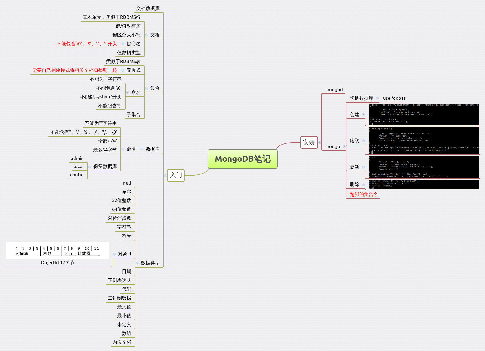

#### NoSQL学习笔记

###### 1.NoSQL
本[站点][1]包含完整的NoSQL现状描述，NoSQL分类，各个NoSQL实现简短介绍。  
对于`文档类`NoSQL，这里有一篇介绍[文章][2]。  

###### 2.MongoDB
参考自[《MongoDB权威指南》][3]。

[1]: http://nosql-database.org/
[2]: http://blog.jobbole.com/9426/
[3]: http://book.douban.com/subject/6068947/