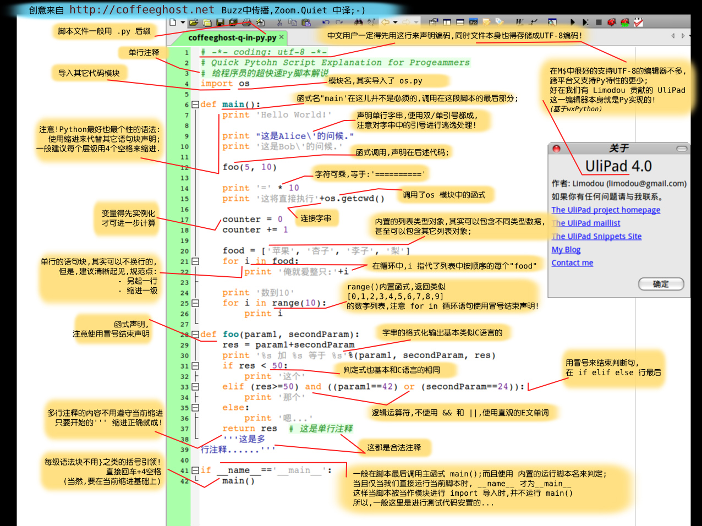
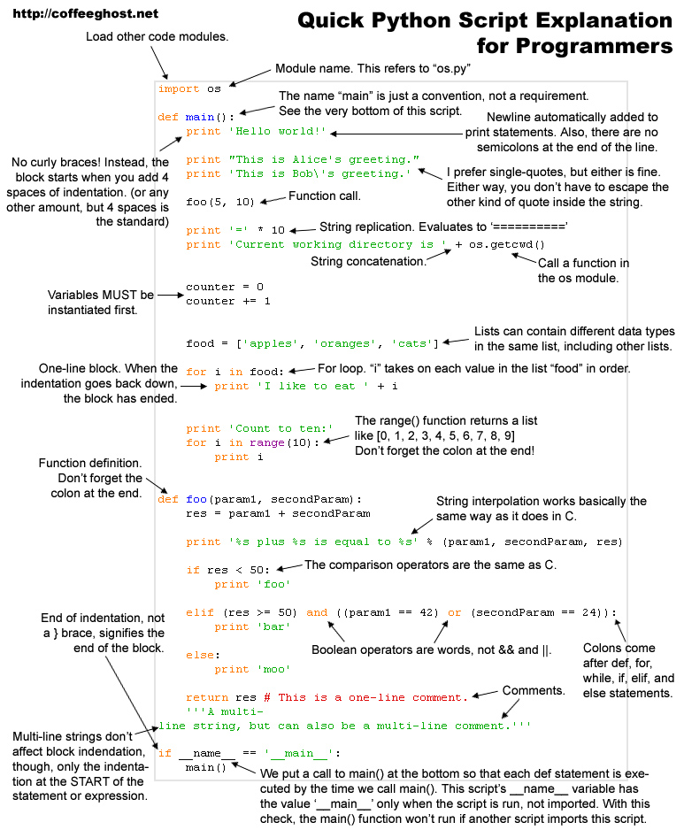

#### Python笔记

###### 1. 一张图片入门Python
中文版  
<center></center>
  
英文版  
<center></center>
  
###### 2. Python输出日志
日志输出代码结构。  
```python
#coding:utf-8

import logging

# 创建logger
logger = logging.getLogger("wwang")
logger.setLevel(logging.INFO)

# 创建handler
handler = logging.StreamHandler()

# 定义输出格式
formatter = logging.Formatter("%(asctime)s-%(name)s-%(levelname)s:%(message)s")

handler.setFormatter(formatter)
logger.addHandler(handler)

def log(msg):
    logger.info(msg)

if __name__ == '__main__':
    log("test")
```
  
  
#### 参考文章
1. [一张图片入门Python][1]
  
  
[1]: http://www.cnblogs.com/youxin/archive/2013/05/05/3061114.html
