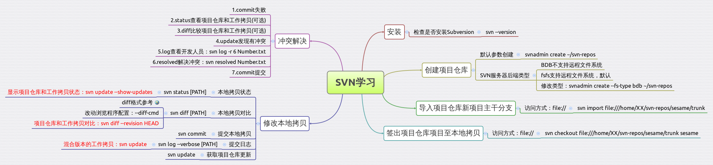

#### SVN学习

###### 笔记思维导图，[下载][3]
  

  

###### 编程访问SVN
1. java方式，推荐[SVNKit][4]。

#### 参考文献
1. [版本控制之道-使用Subversion][1]
2. [读懂diff][2]

[1]: http://book.douban.com/subject/2038779/
[2]: http://www.ruanyifeng.com/blog/2012/08/how_to_read_diff.html
[3]: ./SVN学习.xmind
[4]: http://svnkit.com/index.html
