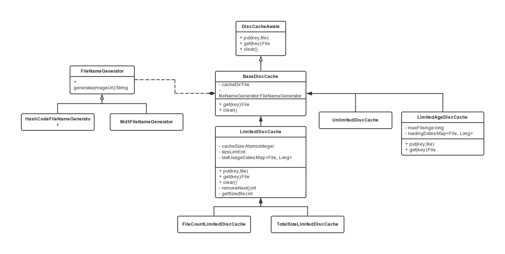
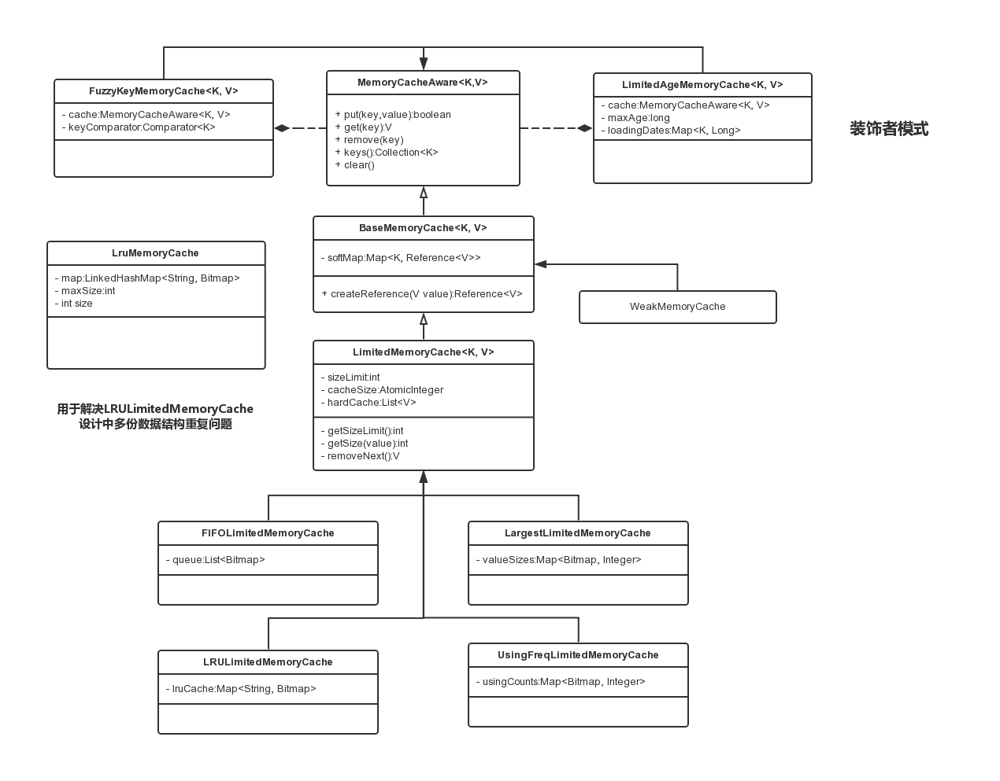

#### UIL学习

###### 1. DiscCache框架
策略模式+工厂方法模式
  

  
###### 2. MemCache框架
策略模式+工厂方法模式+装饰者模式
  

  

#### 几篇参考文献
1. [Android-Universal-Image-Loader-part1][1]
2. [Android-Universal-Image-Loader异步加载图片框架学习][2]

[1]: http://blog.csdn.net/asce1885/article/details/10306623
[2]: http://www.cnblogs.com/PDW-Android/p/3640054.html