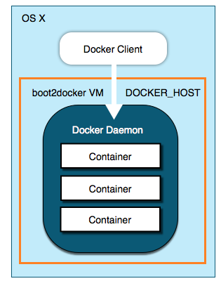
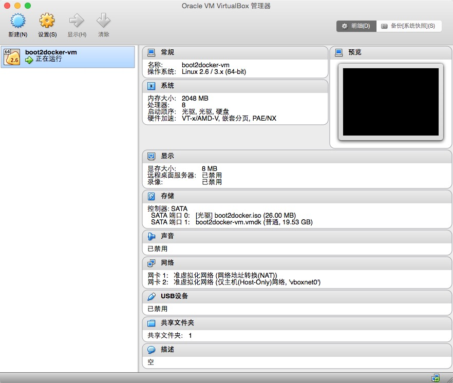
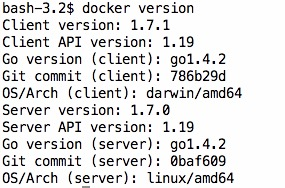

# Docker in OS X

## boot2docker

docker依赖Linux内核特性，所以在Windows、OS X上不能直接跑docker服务，需要先运行Linux虚拟机，然后在Linux虚拟机中运行docker服务，也就有了`boot2docker`工具，进而导致在Windows、OS X上搭建docker运行环境学习成本变高，本文目的就是解决OS X上搭建docker运行环境问题。

`boot2docker`工具包含了`VirtualBox`虚拟机，`boot2docker.iso` Linux镜像，`boot2docker`命令，`docker`命令。

在MAC OS X上玩docker的过程就变成了这样：

1. 使用boot2docker命令，创建一个VirtualBox Linux虚拟机；
2. 使用boot2docker命令，启动这个虚拟机，虚拟机中会同步运行一个docker daemon；
3. 使用docker命令，与虚拟机中docker daemon通信，执行一些docker操作，如下载镜像，启动容器，停止容器等，这里docker命令就是上图的`Docker Client`；

> 注意：boot2docker只是开发人员简单玩玩而已，生产环境不推荐，生产环境还是上Linux相关发行版。

### boot2docker命令使用

#### 创建虚拟机

    boot2docker init

先决条件：cp /usr/local/share/boot2docker/boot2docker.iso ~/.boot2docker/

第一次运行，根据boot2docker.iso创建VirtualBox Linux虚拟机，后续运行不再重复创建。

#### 启动虚拟机

    boot2docker up

启动的虚拟机，可以打开VirtualBox查看。

  
#### 关闭虚拟机

    boot2docker down

#### 删除虚拟机

    boot2docker delete

#### 环境变量设置

    eval "$(boot2docker shellinit)"

主要是VirtualBox Linux虚拟机网络设置。

> boot2docker命令更多使用，boot2docker help

基于上面boot2docker命令使用介绍，完整的起一个docker运行环境的步骤如下：

1. boot2docker init
2. boot2docker up
3. eval "$(boot2docker shellinit)"

docker运行环境起来后，执行 docker version ，如果可以看到如下版本信息，证明docker环境成功起来了，下面就可以进行docker操作实战了。

> 如果遇到`certificate`问题，参考下文【问题fix】部分。

#### 运行hello world容器

所有的编程语言入门都有一个hello world程序，docker入门一样也有一个hello world容器。

下载容器，默认从官方docker hub下载，公司内部网络环境大家是懂的，不配置代理显然是不行的。当然官方docker hub被G|F|W墙这个问题，由于公司代理可以帮你翻墙，也就不再是问题了。

docker容器运行在VirtualBox Linux虚拟机，下载镜像也是由VirtualBox Linux虚拟机中的docker daemon完成，代理显然是配置VirtualBox Linux虚拟机的网络代理。

配置步骤如下：

1. boot2docker ssh，ssh到VirtualBox Linux虚拟机；
2. sudo vi /var/lib/boot2docker/profile，编辑虚拟机配置文件；  
export HTTP_PROXY=http://your.proxy.name:8080  
export HTTPS_PROXY=http://your.proxy.name:8080
3. exit，退出ssh；
4. boot2docker ssh sudo /etc/init.d/docker restart，重启docker daemon；

代理配置好后，就可以从官方docker hub下载镜像了，运行hello world容器，

    docker run hello-world

如果没有问题，会有如下输出。

    ......
    
    Hello from Docker.
    
    ......

hello world容器运行成功，代表OS X上构建的docker环境正常跑起来了，至于docker的使用，不是本篇文章的主题。

#### docker hub TEG盖亚私服接入

...

### 问题fix

#### certificate

执行docker version等命令，报certificate非法，如下：

    An error occurred trying to connect: Get https://192.168.59.1    03:2376/v1.19/version: x509: certificate is valid for 127.0.0.1, 10.0.2.15, not 192.168.59.103

这是boot2docker 1.7.0的一个bug，执行如下命令fix
    
    boot2docker ssh sudo /etc/init.d/docker restart

