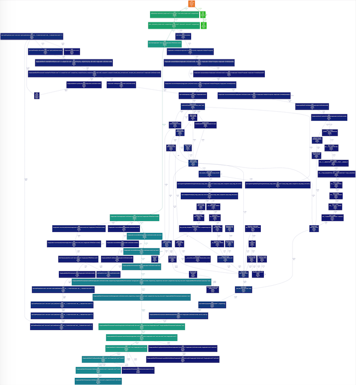
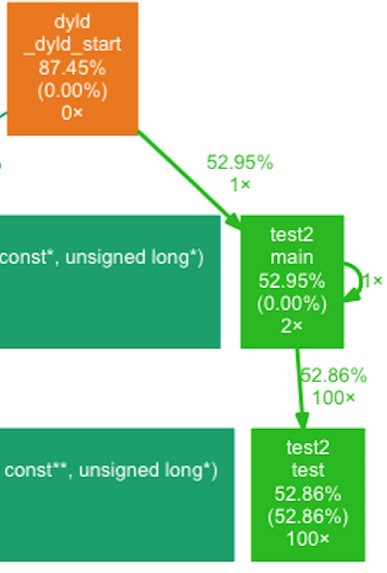
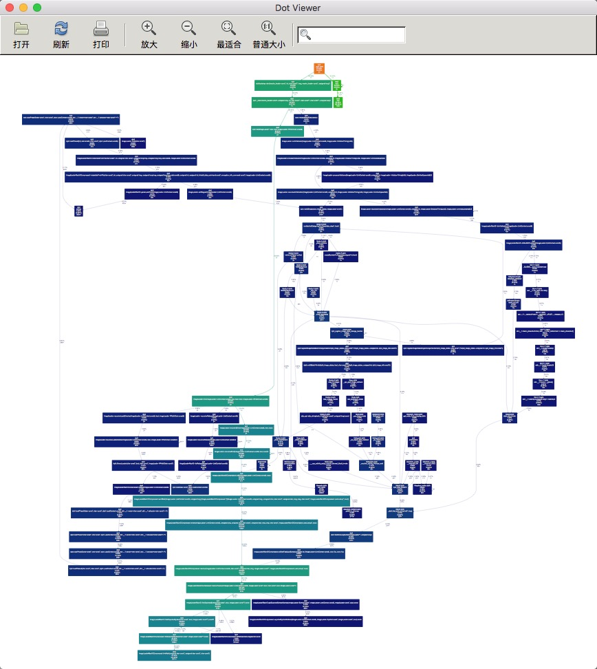
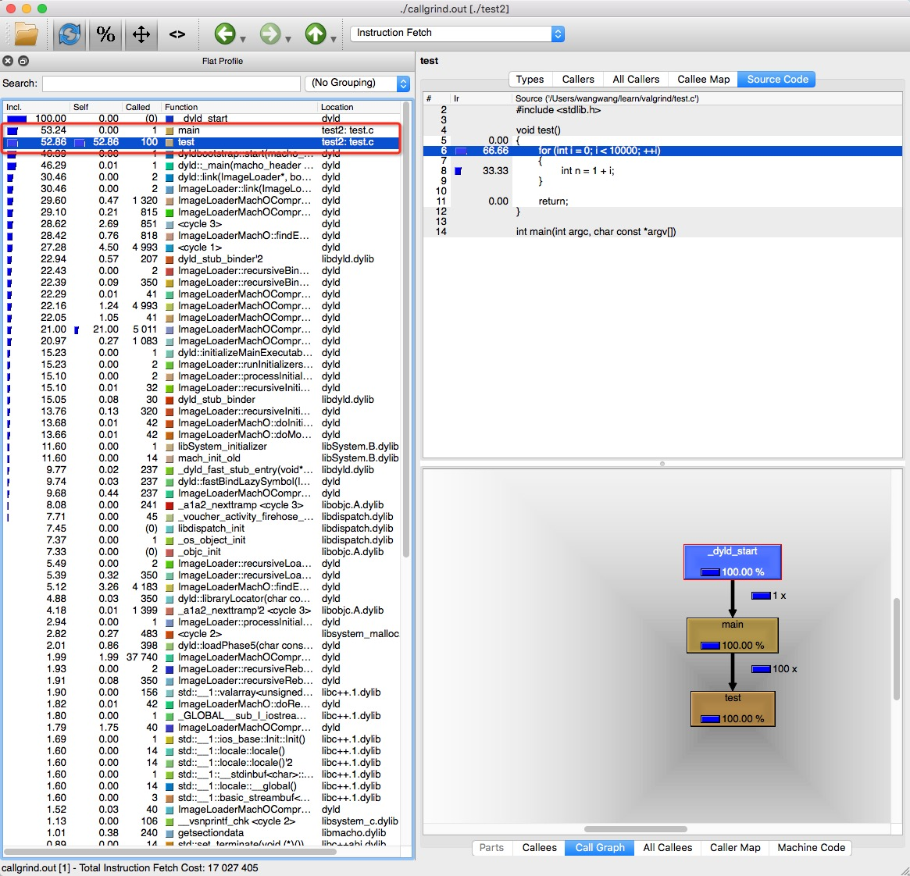

## ndk开发本地代码优化--Linux本地代码优化

ndk开发本身就是对Android App热点逻辑的优化，即用C/C++执行流替代Java执行流，把么ndk开发的native代码是不是就不用优化了呢？  
  
好像也不是吧，如果native代码写的不优美，native层一样会暴露一堆问题，比如内存泄露，函数热点等。  
  
于是花一些业余时间，梳理梳理，ndk开发的本地代码如何优化?  

Android系统内核是Linux，Android上native代码优化策略应该和Linux一致，秉承这个想法，先从Linux上native程序优化方法入手，然后举一反三扩展到Android。  
  
### Linux本地代码优化

Linux本地代码优化，可选择的优化工具，问题定位的方法比较成熟，一堆调优工具中熟悉一些`Valgrind`，故先用`Valgrind`练手。  

`Valgrind`包含两大工具：  

* `Memcheck`，可谓是本地代码运行阶段内存泄露检测利器，所有的内存读写都被检查，hook malloc/new/free/delete调用；  
* `Callgrind`，该工具分析程序运行过程中，各个函数的调用情况以及所占整个程序运行期间的百分比；  

#### Valgrind - Memcheck工具的使用

安装`Valgrind`，可以在[官网](http://valgrind.org/)下载源码包make，由于我用的mac，故直接用homebrew安装。  

```
brew install valgrind
```

这里为了讲解`Memcheck`工具的使用，我们编写了一个小demo，构造有内存泄露的场景：   

```
void f(void)
{
	int* x = malloc(10 * sizeof(int));
	x[10] = 0;
}

int main(void)
{
	f();
	return 0;
}
```

有内存泄露程序`test1`，可以看到f()函数开始位置malloc了一块堆内存，但f()函数返回前没有及时free这块堆内存，这显然是典型的内存泄露，同时`x[10] = 0;`语句涉及内存访问越界的问题，我们看看如何用`Memcheck`工具检测这个泄露点。 

编译test1，注意添加`-g`参数保留行号信息，便于根据`Memcheck`工具输出日志反推源码位置，  

```
gcc -g test1.c -o test1
```

运行test1，使用`Memcheck`工具检测可能内存泄露点，`Valgrind`参数如下所示，这里还有一篇官网 [入门指南](http://valgrind.org/docs/manual/quick-start.html)，  

```
valgrind --tool=memcheck --leak-check=yes ./test1
```

注意：`Memcheck`工具为每一个问题点输出日志信息，越界访问日志如下：  

```
==10331== Invalid write of size 4
==10331==    at 0x100000F4C: f (test.c:29)
==10331==    by 0x100000F73: main (test.c:34)
==10331==  Address 0x100a73188 is 0 bytes after a block of size 40 alloc'd
==10331==    at 0x100007EA1: malloc (vg_replace_malloc.c:303)
==10331==    by 0x100000F43: f (test.c:28)
==10331==    by 0x100000F73: main (test.c:34)
```

10331是进程id，Invalid write表征问题类型，即写非法地址，后两行是函数调用栈信息，还有对应源码行号，这些信息足够让你定位到问题所在然后fix了。  

内存泄露日志如下：  

```
==10331== 40 bytes in 1 blocks are definitely lost in loss record 19 of 59
==10331==    at 0x100007EA1: malloc (vg_replace_malloc.c:303)
==10331==    by 0x100000F43: f (test.c:28)
==10331==    by 0x100000F73: main (test.c:34)
```

definitely lost表征问题类型，即内存泄露，后两行同样是函数调用栈信息，还有对应源码行号，这些信息也足够让你定位到问题所在然后fix了。  

内存泄露日志有两种类型：  
* `definitely lost`，明显的内存泄露，遇到这类问题，必须要fix泄露点；  
* `probably lost`，可能的泄露点，这是由于C/C++语言指针处理的特点造成的，这部分可能不太准确，可以不用管；  

`Memcheck`工具输出的日志我们需要关注的就这些，最后还会有一个总结性的日志，如下：

```
==10331== LEAK SUMMARY:
==10331==    definitely lost: 40 bytes in 1 blocks
==10331==    indirectly lost: 0 bytes in 0 blocks
==10331==      possibly lost: 0 bytes in 0 blocks
==10331==    still reachable: 0 bytes in 0 blocks
==10331==         suppressed: 22,082 bytes in 182 blocks
```

其实这一部分日志基本可以不用关注，这里还是简单说下各个分类的含义：  

* definitely lost: 明确地已经发生泄漏了，你需要修复这里；  
* indirectly lost: 说明内存泄漏发生在基于指针（pointer-based）的数据结构里，如果修复了definitely lost，那么indirectly lost也应该会消失；  
* possibly lost：可能内存泄漏，这是由于C/C++语言指针处理的特点造成的，这部分可能不太准确；  
* still reachable: 表示该内存在程序运行完的时候，仍旧有指针指向它；  
* suppressed：表明这个leak error已经被取消了，你可以忽略掉它；  

上述内容就是`Valgrind`中`Memcheck`工具检测内存泄露的分析方法，是不是特别简单？  

我们按照`Memcheck`工具输出的日志修改相应源码，重新编译运行，日志输出如下：  

```
==11603== ERROR SUMMARY: 0 errors from 0 contexts (suppressed: 16 from 16)
```

日志输出，问题解决了，over~  

#### Valgrind - Callgrind工具的使用

native程序除了可能有内存泄露问题，可能还有函数热点问题，如果native程序执行特别耗时，就需要有一种方法定位到到底耗时在哪里，为什么耗时，是不是可以优化。  

Linux上做这件事情的工具很多，比如`perf`，`gprof`等，这里不对它们进行介绍，因为`Valgrind`中的`Callgrind`工具也可以完成同样的工作，我们就讲讲`Callgrind`工具挖掘函数热点的方法。  

同样这里为了讲解`Callgrind`工具的使用，我们编写了一个小demo，构造函数热点的场景：  

```
void test()
{
	for (int i = 0; i < 10000; ++i)
	{
		int n = 1 + i;
	}

	return;
}

int main(int argc, char const *argv[])
{
	for (int i = 0; i < 100; ++i)
	{
		test();
	}

	printf("hello world\n");

	return 0;
}
```

上述存在函数热点的程序`test2`，可以看到test()函数做了10000次无意义的循环，同时main()函数也做了100次无意义的循环，我们看看如何用`Callgrind`工具检测这些热点。  

编译、运行test2，使用`Callgrind`工具检测可能的函数热点，  

```
gcc -g test2.c -o test2
valgrind --tool=callgrind ./test2
```

当前目录输出`callgrind.out.17023`，17023为进程号。  

注意： 如果你调试的程序是多线程，你也可以在命令行中加一个参数`--separate-threads=yes`，此时当前目录除了输出`callgrind.out.进程号`，还会输出子线程结果文件`callgrind.out.进程号-线程编号`。  


```
valgrind --tool=callgrind --separate-threads=yes ./test2
```

拿到`callgrind.out.17023`文件如何分析？`callgrind.out.17023`是文本描述文件，好办法是图形化，图形化分析方式两种。  

##### 方式一：借助dot工具转png

借助`dot`图形工具，将`callgrind.out.17023`文本描述文件转化为png。  

首先安装`dot`图形工具，`dot`工具包含在`Graphviz`工具包中，先下载`Graphviz`，可以在[官网](http://www.graphviz.org/)下载源码包make，当然mac直接用homebrew安装。  

```
brew install graphviz
````

还需要把`Callgrind`工具输出的性能数据`callgrind.out.17023`转换成`dot`格式数据，还需要一个工具`gprof2dot`完成转换工作，github托管[链接](https://github.com/jrfonseca/gprof2dot)，当然mac用homebrew安装。  


```
brew install gprof2dot
````

`dot`、`gprof2dot`工具都安装ok，执行如下命令便在当前目录输出函数调用关系图，通过png图形我们可以很直观的知道哪段程序执行慢，并且了解相关调用关系。  

```
gprof2dot -f callgrind callgrind.out.17023 | dot -Tpng -o output.png
````

生成的图片示例：  



函数调用关系图很大，因为包含相当多的系统函数调用，我们不看这些，只看自己的函数调用关系，如下所示：  



main()函数时间占比`52.95%`，main()函数又调用test()函数，test()函数时间占比`52.86%`，基本可以看出test()就是热点函数。  

上述内容就是`Valgrind`中`Callgrind`工具检测函数热点的分析方法，是不是也特别简单？

当然如果你觉得输出png太呆板，可以试一试`xdot`工具，`xdot`工具支持交互方式查看函数调用关系图，当前底层还是调用`dot`工具，github托管[链接](https://github.com/jrfonseca/xdot.py)，mac用homebrew安装。  


```
brew install xdot
````

安装`xdot`工具后，执行如下指令，就可以在GUI界面中以交互的方式查看函数调用关系图啦~  

```
gprof2dot -f callgrind callgrind.out.17023 | xdot
````




我们按照`Callgrind`工具输出的信息修改相应源码，重新编译运行，再次输出png，发现函数热点问题解决了，over~  

##### 方式二：借助KCachegrind可视化工具直接打开Callgrind输出文件

上述方式使用`dot`工具将`Callgrind`工具输出转换为png，总觉得还是太麻烦了，如果你喜欢简单，方式二绝对是一个好主意，同时我也推荐能用方式二就不要用方式一。  

`KCachegrind`可视化工具以非常友好的方式输出函数调用关系、函数耗时排名等信息，官网[链接](https://kcachegrind.github.io/html/Home.html)。  

`KCachegrind`GUI部分采用KDE构建或者QT构建，KDE构建的工具命名为`KCachegrind`，QT构建的工具命名为`QCachegrind`，可以按自己喜爱选择，我更偏向QT，所以选择QT构建的`KCachegrind`工具。  

安装`QCachegrind`可以下载源码make，注意依赖QT环境，mac直接用homebrew：  

```
// 依赖graphviz支持
brew install qcachegrind --with-graphviz
```

安装`QCachegrind`后，直接在终端启动，打开`Callgrind`工具输出的结果文件`callgrind.out.17023`，界面如下：  

```
qcachegrind
```



UI左侧按函数执行耗时排序，可以很清楚的知道哪一个函数耗时多，如图main()、test()函数执行耗时可观，是潜在的热点函数。其中，`Incl.`表示inclusive，包含其调用的函数的时间消耗；`Self`表示exclusive，具有排他性，只表示自身的时间消耗。

UI右上部分显示当前函数详细信息，包括源码。  

UI右下角显示当前函数的局部调用图。  

基本上使用`QCachegrind`工具可以很方便、快速的定位到函数热点，剩下的工作就是看源码解决问题了，是不是很简单，哈哈~  

##### 方式一，方式二简单总结

拿到`Callgrind`输出文件两种图形化分析方法，强烈推荐`KCachegrind`方式！  

#### Linux本地代码优化总结

可以看到Linux上本地代码优化还是有很多成熟工具辅助的。当然了工具只是辅助，优化的前提是自己对系统各个模块有一定的了解，同时系统在运行阶段暴露了内存、性能问题，只有在存在优化必要的时候才进行系统优化，避免为了优化而优化这种费力不讨好的工作。  

正所谓工欲善其事，必先利其器，Linux上本地代码优化涉及的方法与工具我们都有了一个基本的认识，下一步就是将这些工具移植到Android平台，检测ndk开发的本地代码，下一篇文章详述。  
