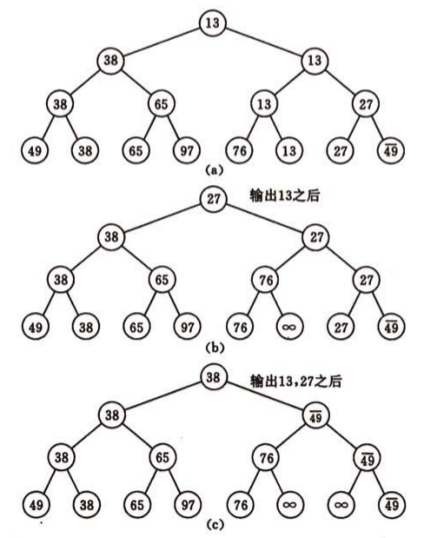
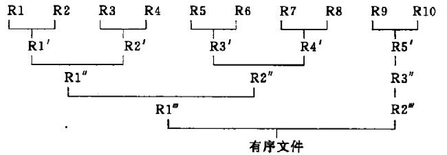

## 数据结构一二

#### 哈希表
哈希函数，尽可能寻找`均匀（uniform）`的哈希函数。  
  
常用构造哈希函数方法：
1. 直接定址法
> 线性函数 H(key) = a * key + b
2. 数字分析法
3. 平方取中法
4. 折叠法
5. 除留余数法
> 一般情况取质数或者不包含小于20的质因数的合数
6. 随机数法
  
哈希`冲突（collision）`，只能尽可能少，不能完全避免。  
  
常见处理冲突方法：
1. 开放定址法
> Hi = (H(key) + di) MOD m，根据di序列取法不同有`线性探测再散列`、`二次探测再散列`、`伪随机探测再散列`
2. 再哈希法
> Hi = RHi(key)
3. 链地址法
4. 建立一个公共溢出区
  
哈希表效率分析：
1. 哈希表裝填因子

#### 插入排序
* 时间复杂度：O(n^2)
* 空间复杂度：O(1)
* 稳定

代码：
  
```c
void insertSort(int arr[], int size) {
	int i = 1;
	for (; i < size; ++i) {
		// 判断是否需要插入
		if (arr[i] < arr[i - 1]) {
			int temp = arr[i];
			arr[i] = arr[i - 1];
			// 后移
			int j = i - 2;
			for (; j >= 0; --j) {
				if (temp < arr[j]) {
					arr[j + 1] = arr[j];
				} else {
					break;
				}
			}
			arr[j + 1] = temp;
		}
	}
}
```
  

改进算法：
* 折半插入排序
* 2-路插入排序
* 希尔排序
> 分割若干子序列插入排序；待整个序列`基本有序`，全体插入排序  
> 算法时间复杂度与所选`增量序列`有关  
  
Shell排序代码：
  
```c
// 一趟shell排序
void shellInsert(int arr[], int size, int dk) {
	int i = dk;
	for (; i < size; ++i) {
		// 判断是否需要插入
		if (arr[i] < arr[i - dk]) {
			int temp = arr[i];
			arr[i] = arr[i - dk];
			// 后移
			int j = i - dk - dk;
			for (; j >= 0; j -= dk) {
				if (temp < arr[j]) {
					arr[j + dk] = arr[j];
				} else {
					break;
				}
			}
			arr[j + dk] = temp;
		}
	}
}

void shellSort(int arr[], int size) {
	int dk[] = { 5, 3, 1 };
	int i = 0;
	for (; i < sizeof(dk) / sizeof(dk[0]); ++i) {
		shellInsert(arr, size, dk[i]);
	}
}
```

#### 冒泡排序
* 时间复杂度：O(n^2)
* 空间复杂度：O(1)
* 稳定

代码：
  
```c
void bubbleSort(int arr[], int size) {
	// 有交换则置1
	int flag = 1;
	// n-1趟冒泡
	int i = size - 1;
	for (; i >= 1 && flag; --i) {
		flag = 0;
		int j = 0;
		for (; j < i; ++j) {
			if (arr[j] > arr[j + 1]) {
				// 交换
				int temp = arr[j];
				arr[j] = arr[j + 1];
				arr[j + 1] = temp;
				flag = 1;
			}
		}
	}
}
```
  
改进部分：设置标志位，当第i趟冒泡没有发生交换操作，则提前跳出。  

#### 快速排序
* 时间复杂度：O(nlog(n))
* 空间复杂度：O(log(n))
* 不稳定

具体步骤：先对整体序列一趟划分`partition`，分割为独立两子序列，递归调用划分。  
  
划分操作：选取`pivot`，比它小移到左侧，比它大移到右侧。

代码：
  
```c
// 划分操作
int partition(int arr[], int low, int high) {
	int pivot = arr[low];
	while (low < high) {
		while (low < high && arr[high] >= pivot) {
			--high;
		}
		// 放置左侧
		arr[low] = arr[high];
		while (low < high && arr[low] <= pivot) {
			++low;
		}
		// 放置右侧
		arr[high] = arr[low];
	}
	arr[low] = pivot;
	return low;
}

void quickSort(int arr[], int low, int high) {
	// 长度大于1
	if (low < high) {
		int pivotIndex = partition(arr, low, high);
		// 对低子表递归
		quickSort(arr, low, pivotIndex - 1);
		// 对高子表递归
		quickSort(arr, pivotIndex + 1, high);
	}
}
```
  
改进部分：划分操作，对pivot选取，比如`三者取中法`。

#### 选择排序
* 时间复杂度：O(n^2)
* 空间复杂度：O(1)
* 稳定

具体步骤：每一趟在后续记录中选取最小的记录作为有序序列中第i个记录。  
  
代码：
  
```c
void selectSort(int arr[], int size) {
	// 选择趟数size - 1
	int i = 0;
	for (; i < size - 1; ++i) {
		// 选择最小
		int index = i;
		int j = i + 1;
		for (; j < size; ++j) {
			if (arr[index] > arr[j]) {
				index = j;
			}
		}
		if (index != i) {
			// 交换
			int temp = arr[i];
			arr[i] = arr[index];
			arr[index] = temp;
		}
	}
}
```

#### 树形选择排序(败者树、胜者树)
* 时间复杂度：O(nlog(n))
* 空间复杂度：O(n)
* 稳定
  
如图所示：
<center></center>
  
代码：
  
```java
    public static int[] completeBinaryTree(int[] arr) {
        int newSize = arr.length * 2 - 1;
        int[] resultArr = new int[newSize];
        if (arr.length == 1) {
            resultArr[0] = arr[0];
            return resultArr;
        }
        for (int i = 0; i < arr.length; ++i) {
            resultArr[newSize - 1 - i] = arr[arr.length - 1 - i];
        }
        if (arr.length == 2) {
            resultArr[0] = arr[0] > arr[1] ? arr[1] : arr[0];
        }
        // 构建完全二叉树(败者树)
        int minIndex = (newSize - 1 - 1) / 2;
        while (minIndex > 0) {
            for (int i = newSize - 1; i > 0; i -= 2) {
                minIndex = (i - 1) / 2;
                resultArr[minIndex] = resultArr[i] > resultArr[i - 1] ? resultArr[i - 1] : resultArr[i];
            }
        }

        return resultArr;
    }

    public static void treeSort(int[] arr) {
        if (arr == null || arr.length == 0) {
            return;
        }

        int[] tree = completeBinaryTree(arr);
        int arrLen = arr.length;
        int treeLen = tree.length;

        for (int i = 0; i < arrLen; ++i) {
            arr[i] = tree[0];

            // 查找
            int minIndex = 0;
            for (int j = treeLen - 1; j > 0; --j) {
                if (tree[0] == tree[j]) {
                    minIndex = j;
                    tree[j] = Integer.MAX_VALUE;
                    break;
                }
            }

            // 败者树恢复
            while (minIndex > 0) {
                if (minIndex % 2 == 0) {
                    tree[(minIndex - 1) / 2] = tree[minIndex] > tree[minIndex - 1] ? tree[minIndex - 1] : tree[minIndex];
                    minIndex = (minIndex - 1) / 2;
                } else {
                    tree[minIndex / 2] = tree[minIndex] > tree[minIndex + 1] ? tree[minIndex + 1] : tree[minIndex];
                    minIndex = minIndex / 2;
                }
            }
        }

    }
```
  

#### 堆排序
* 时间复杂度：O(nlog(n))
* 空间复杂度：O(1)
* 不稳定

具体步骤：**建堆**，输出堆顶元素，调整堆。
> 建堆过程，即是反复调整堆的过程。
  
代码：
  
```c
// 堆调整（大顶堆），堆采用数组存储，下标1, 2, ..., n
void heapAdjust(int arr[], int s, int len) {
	int rc = arr[s];
	// 调整
	int j = 2 * s;
	for (; j <= len; j *= 2) {
		// 选取左右子树最大值下标
		if (j < len && arr[j] < arr[j + 1]) {
			++j;
		}
		// 判断是否需要终止调整过程
		if (rc >= arr[j]) {
			break;
		} else {
			arr[s] = arr[j];
			s = j;
		}
	}
	arr[s] = rc;
}

void heapSort(int arr[], int size) {
	// 建堆
	int i = size / 2;
	for (; i > 0; --i) {
		heapAdjust(arr, i, size);
	}
	// 排序
	for (i = size; i > 1; --i) {
		// 交换
		int temp = arr[i];
		arr[i] = arr[1];
		arr[1] = temp;
		// 调整
		heapAdjust(arr, 1, i - 1);
	}
}
```
  
#### 归并排序
2-路归并排序
* 时间复杂度：O(nlog(n))
* 空间复杂度：O(n)
* 稳定

代码：
  
```java
// 归并操作，arr[i..m]与arr[m+1..n]归并到arr2[i..n]
void merge(int arr[], int arr2[], int i, int m, int n) {
	int k = i;
	int j = m + 1;
	for (; i <= m && j <= n; ++k) {
		if (arr[i] < arr[j]) {
			arr2[k] = arr[i++];
		} else {
			arr2[k] = arr[j++];
		}
	}
	// 剩余项处理
	for (; i <= m; ++i) {
		arr2[k++] = arr[i];
	}
	for (; j <= n; ++j) {
		arr2[k++] = arr[j];
	}
}

// 归并递归项
void mergeSort(int arr[], int arr2[], int low, int high) {
	if (low == high) {
		arr2[low] = arr[low];
	} else {
		int m = (low + high) / 2;
		int arr3[8];
		mergeSort(arr, arr3, low, m);
		mergeSort(arr, arr3, m + 1, high);
		// 归并
		merge(arr3, arr2, low, m, high);
	}
}
```
  
#### 外部排序
步骤：
1. 将外存n个记录的文件分割成m个长度为l的子文件（可以采用hash）；
2. 依次读入子文件，内部排序，写回外存，称这些有序子文件为`归并段`；
3. 对这些`归并段`，采用k-路平衡归并，直到整个文件有序。
> 对m个初始归并段进行k-路平衡归并，归并趟数 s = [logk(m)]下取整。
  
比如`2-路平衡归并`：
<center></center>
  
简单的递归实现，输入`5个归并段`，2-路平衡归并：
  
```java
public static List<Integer> merge(List<Integer> data1, List<Integer> data2) {
    if (data1 == null && data2 != null) {
        return data2;
    }
    if (data1 != null && data2 == null) {
        return data1;
    }
    if (data1 == null && data2 == null) {
        return new ArrayList<Integer>();
    }

    List<Integer> result = new ArrayList<Integer>();

    int i = 0, j = 0;
    for (; i < data1.size() && j < data2.size(); ) {
        if (data1.get(i) < data2.get(j)) {
            result.add(data1.get(i));
            ++i;
        } else {
            result.add(data2.get(j));
            ++j;
        }
    }

    for (; i < data1.size(); ++i) {
        result.add(data1.get(i));
    }
    for (; j < data2.size(); ++j) {
        result.add(data2.get(j));
    }

    return result;
}

public static List<Integer> mergeSort(List<List<Integer>> data) {
    if (data == null || data.isEmpty()) {
        return new ArrayList<Integer>();
    }

    if (data.size() == 1) {
        return new ArrayList<Integer>(data.get(0));
    }

    if (data.size() == 2) {
        return merge(data.get(0), data.get(1));
    }

    int size = data.size();
    List<Integer> temp1 = mergeSort(data.subList(0, size / 2));
    List<Integer> temp2 = mergeSort(data.subList(size / 2, size));
    return merge(temp1, temp2);
}

// 测试
List<List<Integer>> data = new ArrayList<List<Integer>>();
List<Integer> data1 = new ArrayList<Integer>(Arrays.asList(1, 3));
List<Integer> data2 = new ArrayList<Integer>(Arrays.asList(5, 7));
List<Integer> data3 = new ArrayList<Integer>(Arrays.asList(0, 2));
List<Integer> data4 = new ArrayList<Integer>(Arrays.asList(4, 6));
List<Integer> data5 = new ArrayList<Integer>(Arrays.asList(8, 9));
data.add(data1);
data.add(data2);
data.add(data3);
data.add(data4);
data.add(data5);

System.out.println(mergeSort(data).toString());
```
  
比较操作可以借助`胜者树`、`败者树`加以改进。

