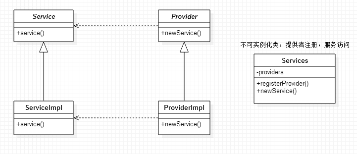

#### 服务提供者框架

###### 1. 定义
多个服务提供者实现一个服务，系统为客户端提供多个实现，并把它们从多个实现中解耦出来。
  
相关组件：
* 服务接口
* 服务提供者接口
* 提供者注册API
* 服务访问API

###### 2. 实现，参考JDBC、JMS


###### 3. 代码
* Service.java
  
```java
public interface Service {

    public void service();

}
```
  
* ServiceImpl.java
  
```java
public class ServiceImpl implements Service {

    @Override
    public void service() {
        System.out.println("service by " + ServiceImpl.class.getSimpleName());
    }

}
```
  
* Provider.java
  
```java
public interface Provider {

    public Service newService();

}
```
  
* ProviderImpl.java
  
```java
public class ProviderImpl implements Provider {

    static {
        Services.registerProvider(ProviderImpl.class.getName(), new ProviderImpl());
    }

    @Override
    public Service newService() {
        return new ServiceImpl();
    }

}
```
  
* 测试
  
```java
public class Main {

    public static void main(String[] args) {
        try {
            Class.forName("com.tencent.victor.ProviderImpl");
            Service service = Services.newService("com.tencent.victor.ProviderImpl");
            service.service();
        } catch (ClassNotFoundException e) {
            e.printStackTrace();
        }
    }
    
}
```
  
