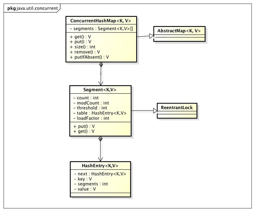

## 简单说说HashMap，HashTable，ConcurrentHashTable

#### 背景
* 线程不安全的`HashMap`  
多线程环境下，使用`HashMap`进行`put`操作会引起死循环，导致`CPU`利用率接近100%  
> 参见：[不正当使用HashMap导致cpu 100%的问题追究][4]，原因为多线程下`HashMap`扩容，可能会创建出两个新数组容器，造成链表闭环，导致死循环  

* 效率低下的`HashTable`  
使用`synchronized`保证线程安全  
线程竞争激烈情况下效率非常低下  

* `ConcurrentHashMap`的锁分段技术  
锁分拆技术(lock spliting)  
锁分离技术(lock striping)  
> 分拆锁(lock spliting)就是若原先的程序中多处逻辑都采用同一个锁，但各个逻辑之间又相互独立，就可以拆(Spliting)为使用多个锁，每个锁守护不同的逻辑。分拆锁有时候可以被扩展，分成可大可小加锁块的集合，并且它们归属于相互独立的对象，这样的情况就是分离锁(lock striping)。  
> （摘自《Java并发编程实践》）  

  `ConcurrentHashMap`类图  
  
  `ConcurrentHashMap`结构图  
  

#### TO DO LIST
1. [ConcurrentHashMap能完全替代HashTable吗？][5]
2. 源码分析...

#### 参考文献：
1. [聊聊并发（四）深入分析ConcurrentHashMap][1]
2. [深入剖析ConcurrentHashMap(1)][2]
3. [深入剖析ConcurrentHashMap(2)][3]

[1]: http://ifeve.com/concurrenthashmap/
[2]: http://ifeve.com/java-concurrent-hashmap-1/
[3]: http://ifeve.com/java-concurrent-hashmap-2/
[4]: http://ifeve.com/hashmap-infinite-loop/
[5]: http://ifeve.com/concurrenthashmap-vs-hashtable/